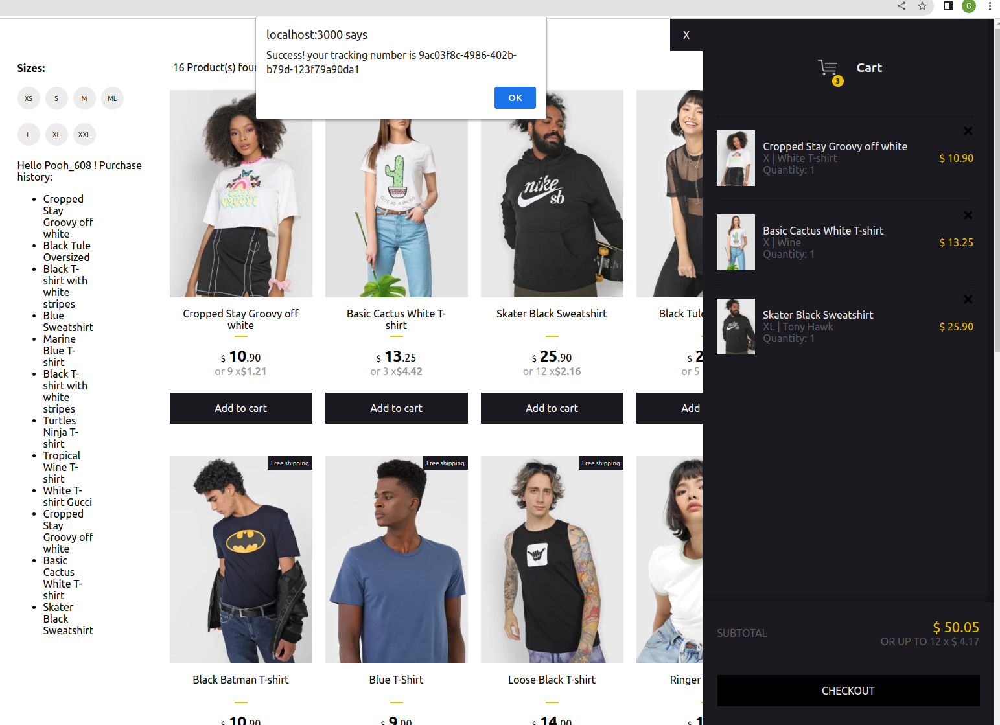
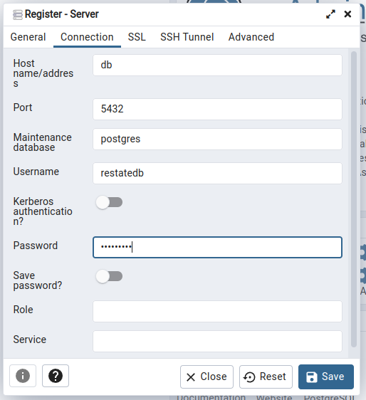
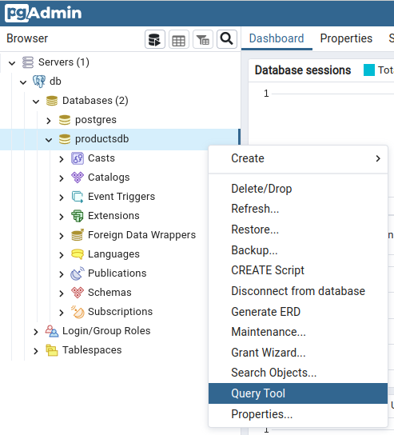
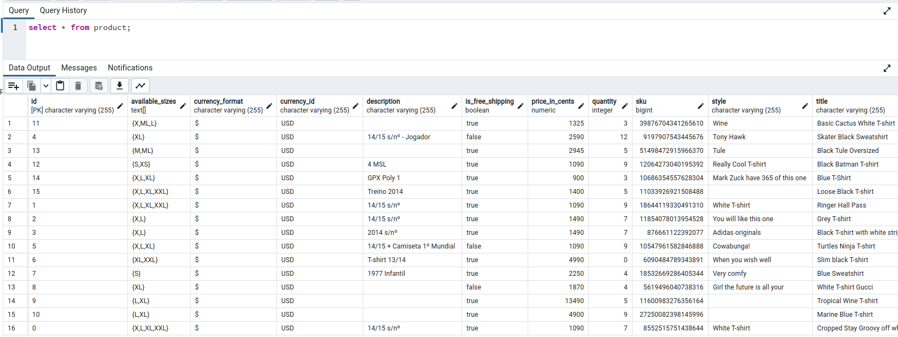

# Restate's ecommerce store example

This repository contains an example of an ecommerce store implemented with Restate. The example runs on Docker Compose, Kubernetes + Knative, or on AWS ECS/Fargate.

Restate is a system for easily building resilient applications using **distributed durable RPC & async/await**.

❓ Learn more about Restate from the [documentation](https://docs.restate.dev).



## Prerequisites

- Latest stable version of [NodeJS](https://nodejs.org/en/) >= v18.17.1 and [npm CLI](https://docs.npmjs.com/downloading-and-installing-node-js-and-npm) >= 9.6.7 installed.
- [Docker Engine](https://docs.docker.com/engine/install/) to launch the Restate runtime (not needed for the app implementation itself).
- Optional: Docker Compose
- Optional: AWS account with permissions for ECS, RDS, ECR, security groups, VPC, service discovery, IAM roles.

## Download the example

You can clone the example repository (`git clone https://github.com/restatedev/examples`) or just download this example via

- **CLI:** `restate example typescript-ecommerce-store`

- **Zip archive:** https://github.com/restatedev/examples/releases/latest/download/typescript-ecommerce-store.zip


## Deployment on Docker Compose

You can store the products data in the Restate runtime or in a separate Postgres DB:

1. To store the products in Restate state, bring up the Docker Compose setup via:

```shell
docker compose -f deployment/docker/docker-compose.yml build --no-cache
docker compose -f deployment/docker/docker-compose.yml up
```

2. To store the products in a Postgres DB, bring up the Docker Compose setup via:

```shell
docker compose -f deployment/docker/docker-compose-pg.yml build --no-cache
docker compose -f deployment/docker/docker-compose-pg.yml up
```

Go to http://localhost:3000 to see the web app UI and buy some products.

The pgAdmin UI runs at http://localhost:5050/.
Have a look at the demo scenario below to understand how to log in and use it.

You can find the Jaeger UI at http://localhost:16686. Have a look at the demo scenario for more details.

## Deployment on kind with Knative

You can find the deployment guide for Kubernetes (kind) and Knative [here](./deployment/knative/README.md).

## Running locally

The demo also runs locally. This option doesn't store the products in a Postgres database.

Start the shopping services:

```shell
cd services
npm install
npm run proto
npm run build
npm run app
```

The services are now running.

See [how to launch the Restate Server](../../README.md#launching-the-restate-server) and [how to register services](../../README.md#register-the-deployment-in-restate) for details.

Run the web app:

```shell
cd react-shopping-cart
npm install
npm start
```

Local deployment doesn't use a pre-filled database, so you need to manually fill the state by running:

```shell
cd deployment/local
./init_state.sh "localhost:8080"
```

Go to http://localhost:3000 to see the UI and buy some products.

## Demo scenario for Docker Compose with Postgres

This demo scenario assumes that you run the setup with Docker Compose and the external PostgreSQL database.
You can see the web app at http://localhost:3000.
Add some products to your shopping cart and have a look at the requests in the logs of the services.


The Product service (Spring boot application) connects to the Postgres DB.
The pgAdmin UI runs at http://localhost:5050.
Login with username `admin@restate.dev` and password `admin`. Then click on `Add new server`:


In the `General` tab of the pop-up, fill in `db` as the database name. Leave the rest to default.


In the `Connection` tab, fill in `db` as hostname/address (or the hostname of the RDS database for AWS deployments), `productsdb` as maintenance DB, and `restatedb` as username and password. Then click `Save`.



In the bar/browser on the left, expand `db` and `Databases`:



Here you see the available databases. This demo saves the data in the `productsdb` database.
Query the database from the UI by right-clicking `productsdb` and then selecting `Query tool`.

You can write queries in the window that opens up.
Execute the query by pressing the play button or `F5`.
Have a look at the `product` table by executing the following query:

```roomsql
select * from product;
```

If all went well, you see a list of all the products in the database:



When you scroll through the products, you see that some products only have a few pieces in stock.
For example, the `Basic Cactus White T-shirt` only has three pieces left.
Filter out the results of this product by executing:

```roomsql
select * from product where id = '11';
```

To see how services interact, let's deplete the stock of this product.
Open up the web app again at http://localhost:3000 and order the `Basic Cactus White T-shirt` three times.
Press `Checkout` every time you add this product to your cart. When you add a product, the following happens:

1. The web app sends a request to `ShoppingCartService/AddProduct` to add the product to the cart.
2. The `AddProduct` method of the `ShoppingCartService` receives the request and tries to reserve the product by sending a request to `ProductService/Reserve`.
3. The `Reserve` method of the `ProductService` decrements the quantity of the product in the PostgreSQL database, if the quantity is larger than zero. If the quantity is zero (= no rows were updated in the database), then it responds to the `ShoppingCartService/AddProduct` method that the reservation was unsuccessful. If the quantity was larger than zero, then it responds with a success message.

When you press `Checkout`, the checkout flow gets triggered. Check out `src/checkout_flow_service.ts` for the code that gets executed.

When you order the last item of a product, you notice that 15 seconds later the product is available again.
This is due to a delayed call to `InventoryRestockService/OrderProduct` that is done by the `ProductService/NotifyProductSold` method during the checkout flow.

Have a look at the logs of the service (via `docker logs <container-id>`) or the runtime, to see how requests are routed and answered.

After buying some products, we should have some interesting traces in Jaeger.
Go to the Jaeger UI at http://localhost:16686 and select the `io.shoppingcart.ShoppingCartService` from the service dropdown.
Select the trace that was generated when we bought the last item of the cactus T-shirt.


You see how the request invoked a workflow that triggered multiple functions.
We can see that:

- `io.shoppingcart.ShoppingCartService/Checkout` was invoked which retrieved the `status`, `cart` and `user_id` from state, and then called `io.shoppingcart.CheckoutFlowService/Start`.
- The Checkout function requested the user profile, then requested to prepare the shipment, to handle the payment, and to send the email. After the successful payment, the purchase was appended to the user profile, and the product was marked as sold.
- Because this was the last available item, we see the request to `io.shoppingcart.InventoryRestockService/OrderProduct`.

You can expand the traces to see more information such as the invocation id (can be used to request more information on the invocation via the Restate CLI),
and the invocation result. Have a look around in the Jaeger UI to see what else is traced.

## Attribution

The implementation of the web app is based on the MIT Licensed repository here: https://github.com/jeffersonRibeiro/react-shopping-cart.

## Releasing (for Restate developers)

### Upgrading Typescript SDK

Upgrade the `@restatedev/restate-sdk` version as described [here](../../README.md#upgrading-the-sdk-dependency-for-restate-developers).
Then run the example:

- on Docker Compose with and without a database
- on kind + Knative
- on AWS
