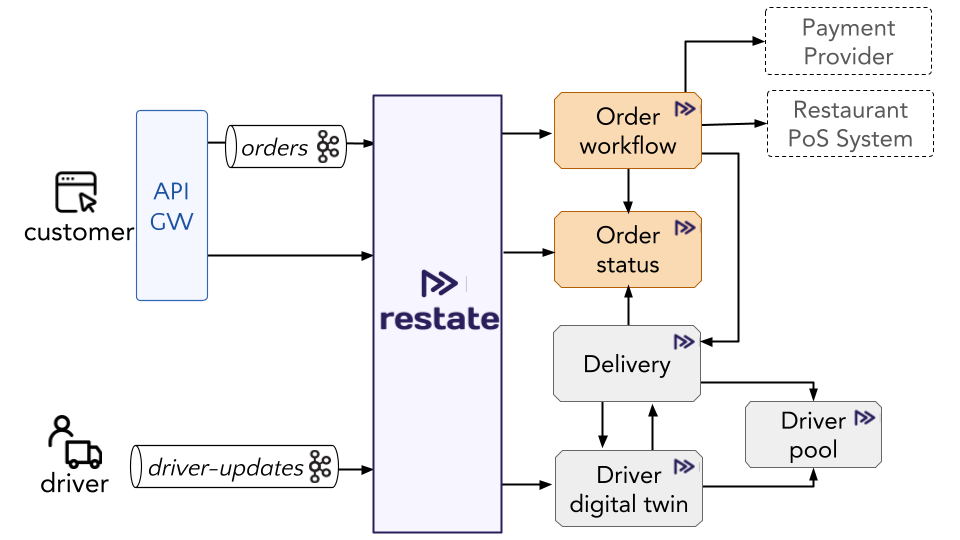

# Food ordering app with Restate

This example application implements an order processing middleware which sits between third-party food ordering providers and restaurants.
Food ordering providers interact with the application by publishing events to Kafka.
For each event, Restate triggers the `handleEvent` workflow of the order service.
The order service interacts with the restaurants' external point of sale service to request the preparation of the orders.
It also interacts with the delivery services to get the order delivered to the customer once preparation is done.



The app logic (order workflow) discussed in the presentation can be found under: `app/restate-app/src/main/java/dev/restate/sdk/examples/OrderService.java`.

## Running locally with Docker compose

Launch the Docker compose setup:
```shell
docker compose up
```

WebUI is running at http://localhost:3000

Jaeger is running at http://localhost:16686

Clean up after bringing setup down:
```shell
docker compose rm 
```

## Exploring the demo

Restate has a psql interface to query the state of the system.

If you buy some products via the webUI, you can see how the order workflow is executed by querying the state of the order status service:
```shell
watch -n 1 'psql -h localhost -p 9071 -c "select service, service_key_utf8, key, value_utf8 from state s where s.service='"'"'order.OrderStatusService'"'"';"'
```

Or have a look at the state of all the services, except for the driver simulator:
```shell
watch -n 1 'psql -h localhost -p 9071 -c "select service, service_key_utf8, key, value_utf8 from state s where s.service not in ('"'"'order.DriverSimService'"'"');"'
```

Or you can check the state of the ongoing invocations via:
```shell
watch -n 1 'psql -h localhost -p 9071 -c "select service, method, service_key_utf8, id, status, invoked_by_service, invoked_by_id from sys_status;"'
```

## Attribution

The implementation of the web app is based on the MIT Licensed repository here: https://github.com/jeffersonRibeiro/react-shopping-cart.

## Releasing (for Restate developers)

### Upgrading Java SDK
Upgrade the Restate SDK dependencies for the `app`.
Then run the example via Docker compose.

### Upgrading Restate runtime
The Docker Compose setup uses the latest Restate runtime version.
Test run the example via Docker compose.