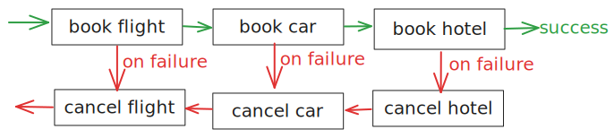
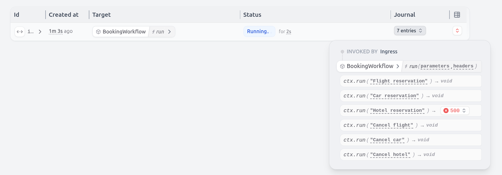
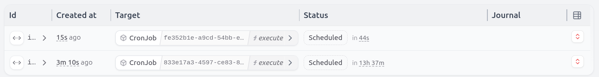
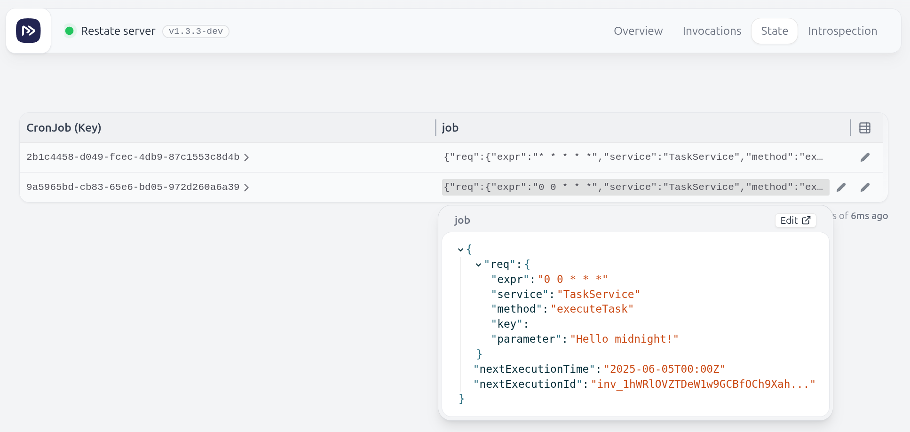

# Java Patterns and Use Cases

#### Communication
- **[Durable RPC, Idempotency & Concurrency](README.md#durable-rpc-idempotency--concurrency)**: Restate persists requests and makes sure they execute exactly-once. [](src/main/java/my/example/durablerpc/MyClient.java)
- **[(Delayed) Message Queue](README.md#delayed-message-queue)**: Use Restate as a queue. Schedule tasks for now or later and ensure the task is only executed once. [](src/main/java/my/example/queue/TaskSubmitter.java)
- **[Convert Sync Tasks to Async](README.md#convert-sync-tasks-to-async)**: Kick off a synchronous task (e.g. data upload) and turn it into an asynchronous one if it takes too long. [](src/main/java/my/example/syncasync/UploadClient.java)

#### Orchestration patterns
- **[Sagas](README.md#sagas)**: Preserve consistency by tracking undo actions and running them when code fails halfway through. [](src/main/java/my/example/sagas/BookingWorkflow.java)
- **[Stateful Actors and State Machines](README.md#stateful-actors-and-state-machines)**: State machine with a set of transitions, built as a Restate Virtual Object for automatic state persistence. [](src/main/java/my/example/statefulactors/MachineOperator.java)
- **[Payment State Machines (Advanced)](README.md#payment-state-machines)**: State machine example that tracks a payment process, ensuring consistent processing and cancellations. [](src/main/java/my/example/statemachinepayments/PaymentProcessor.java)

#### Scheduling
- **[Cron Jobs](README.md#cron-jobs)**: Implement a cron service that executes tasks based on a cron expression. [](src/main/java/my/example/cron/Cron.java)
- **[Scheduling Tasks](README.md#scheduling-tasks)**: Restate as scheduler: Schedule tasks for later and ensure the task is triggered and executed. [](src/main/java/my/example/schedulingtasks/PaymentTracker.java)
- **[Parallelizing Work](README.md#parallelizing-work)**: Execute a list of tasks in parallel and then gather their result. [](src/main/java/my/example/parallelizework/FanOutWorker.java)
- **[Payment Signals (Advanced)](README.md#payment-signals)**: Handling async payment callbacks for slow payments, with Stripe. [](src/main/java/my/example/signalspayments/PaymentService.java)

#### Event processing
- **[Transactional Event Processing](README.md#transactional-event-processing)**: Processing events (from Kafka) to update various downstream systems in a transactional way. [](src/main/java/my/example/eventtransactions/UserFeed.java)
- **[Event Enrichment / Joins](README.md#event-enrichment--joins)**: Stateful functions/actors connected to Kafka and callable over RPC. [](src/main/java/my/example/eventenrichment/PackageTracker.java)

## Durable RPC, Idempotency & Concurrency
[](src/main/java/my/example/durablerpc/MyClient.java)

This example shows:
- **Durable RPC**: once a request has reached Restate, it is guaranteed to be processed
- **Exactly-once processing**: Ensure that duplicate requests are not processed multiple times via idempotency keys
- **Concurrency**: Restate executes requests to the same Virtual Object key sequentially, to ensure consistency of its K/V state

The example shows how you can programmatically submit a requests to a Restate service.
Every request gets processed durably, and deduplicated based on the idempotency key.

- The[client](src/main/java/my/example/durablerpc/MyClient.java) that receives product reservation requests and forwards them to the product service.
- The [Product service](src/main/java/my/example/durablerpc/ProductService.java) is a Restate service that durably processes the reservation requests and deduplicates them. Each product can be reserved only once.

<details>
<summary><strong>Running the example</strong></summary>

1. [Start the Restate Server](https://docs.restate.dev/develop/local_dev) in a separate shell: `restate-server`
2. Start the service: `./gradlew -PmainClass=my.example.durablerpc.ProductService run`
3. Register the services (with `--force` to override the endpoint during **development**): `restate -y deployments register --force localhost:9080`

Run the client to let it send a request to reserve a product:
```shell
./gradlew -PmainClass=my.example.durablerpc.MyClient run --args="product132 reservation123"
```
The response will be `true`.

Let's change the reservation ID and run the request again:
```shell
./gradlew -PmainClass=my.example.durablerpc.MyClient run --args="product132 reservation456"
```
This will give us `false` because this product is already reserved, so we can't reserve it again.

However, if we run the first request again with same reservation ID, we will get `true` again:
```shell
./gradlew -PmainClass=my.example.durablerpc.MyClient run --args="product132 reservation123"
``` 
Restate deduplicated the request (with the reservation ID as idempotency key) and returned the first response.

</details>

## (Delayed) Message Queue
[](src/main/java/my/example/queue/TaskSubmitter.java)

Use Restate as a queue. Schedule tasks for now or later and ensure the task is only executed once.

- [Task Submitter](src/main/java/my/example/queue/TaskSubmitter.java): schedules tasks via send requests with and idempotency key.
    - The **send requests** put the tasks in Restate's queue. The task submitter does not wait for the task response.
    - The **idempotency key** in the header is used by Restate to deduplicate requests.
    - If a delay is set, the task will be executed later and Restate will track the timer durably, like a **delayed task queue**.
- [Async Task Worker](src/main/java/my/example/queue/AsyncTaskWorker.java): gets invoked by Restate for each task in the queue.

## Convert Sync Tasks to Async
[](src/main/java/my/example/syncasync/UploadClient.java)

This example shows how to use the Restate SDK to **kick of a synchronous task and turn it into an asynchronous one if it takes too long**.

The example implements a [data upload service](src/main/java/my/example/syncasync/DataUploadService.java), that creates a bucket, uploads data to it, and then returns the URL.

The [upload client](src/main/java/my/example/syncasync/UploadClient.java) does a synchronous request to upload the file, and the server will respond with the URL.

If the upload takes too long, however, the client asks the upload service to send the URL later in an email.

<details>
<summary><strong>Running the example</strong></summary>

1. [Start the Restate Server](https://docs.restate.dev/develop/local_dev) in a separate shell: `restate-server`
2. Start the service: `./gradlew -PmainClass=my.example.syncasync.DataUploadService run`
3. Register the services (with `--force` to override the endpoint during **development**): `restate -y deployments register --force localhost:9080`

Run the upload client with a userId: `./gradlew -PmainClass=my.example.syncasync.UploadClient run --args="someone21"`

This will submit an upload workflow to the data upload service.
The workflow will run only once per ID, so you need to provide a new ID for each run.

Have a look at the logs to see how the execution switches from synchronously waiting to the response to requesting an email:

<details>
<summary><strong>View logs: fast upload</strong></summary>

Client logs:
```
2024-12-18 15:02:34 INFO   my.example.UploadClient - Uploading data for user someone212
2024-12-18 15:02:36 INFO   my.example.UploadClient - Fast upload... URL was https://s3-eu-central-1.amazonaws.com/257587941/
```
Workflow logs:
```
2024-12-18 15:02:34 INFO  [DataUploadService/run][inv_17cZwACLnO7f5m1BjN7SKoQpuyycCmWwnv] dev.restate.sdk.core.InvocationStateMachine - Start invocation
2024-12-18 15:02:34 INFO  [DataUploadService/run][inv_17cZwACLnO7f5m1BjN7SKoQpuyycCmWwnv] my.example.utils.DataOperations - Creating bucket with URL https://s3-eu-central-1.amazonaws.com/257587941/
2024-12-18 15:02:34 INFO  [DataUploadService/run][inv_17cZwACLnO7f5m1BjN7SKoQpuyycCmWwnv] my.example.utils.DataOperations - Uploading data to target https://s3-eu-central-1.amazonaws.com/257587941/. ETA: 1500 ms
2024-12-18 15:02:36 INFO  [DataUploadService/run][inv_17cZwACLnO7f5m1BjN7SKoQpuyycCmWwnv] dev.restate.sdk.core.InvocationStateMachine - End invocation
```
</details>

<details>
<summary><strong>View logs: slow upload</strong></summary>

Client logs:
```
2024-12-18 15:02:41 INFO   my.example.UploadClient - Uploading data for user someone2122
2024-12-18 15:02:46 INFO   my.example.UploadClient - Slow upload... Mail the link later
```

Workflow logs:
```
2024-12-18 15:02:41 INFO  [DataUploadService/run][inv_1koakM2GXxcN2Co3aM3pSrQJokiqnyR7MJ] dev.restate.sdk.core.InvocationStateMachine - Start invocation
2024-12-18 15:02:41 INFO  [DataUploadService/run][inv_1koakM2GXxcN2Co3aM3pSrQJokiqnyR7MJ] my.example.utils.DataOperations - Creating bucket with URL https://s3-eu-central-1.amazonaws.com/493004051/
2024-12-18 15:02:41 INFO  [DataUploadService/run][inv_1koakM2GXxcN2Co3aM3pSrQJokiqnyR7MJ] my.example.utils.DataOperations - Uploading data to target https://s3-eu-central-1.amazonaws.com/493004051/. ETA: 10000 ms
2024-12-18 15:02:46 INFO  [DataUploadService/resultAsEmail][inv_1koakM2GXxcN7veCWCBDo77G0P2BIX7KFz] dev.restate.sdk.core.InvocationStateMachine - Start invocation
2024-12-18 15:02:51 INFO  [DataUploadService/run][inv_1koakM2GXxcN2Co3aM3pSrQJokiqnyR7MJ] dev.restate.sdk.core.InvocationStateMachine - End invocation
2024-12-18 15:02:51 INFO  [DataUploadService/resultAsEmail][inv_1koakM2GXxcN7veCWCBDo77G0P2BIX7KFz] my.example.utils.EmailClient - Sending email to https://s3-eu-central-1.amazonaws.com/493004051/ with url someone2122@example.com
2024-12-18 15:02:51 INFO  [DataUploadService/resultAsEmail][inv_1koakM2GXxcN7veCWCBDo77G0P2BIX7KFz] dev.restate.sdk.core.InvocationStateMachine - End invocation
```
You see the call to `resultAsEmail` after the upload took too long, and the sending of the email.

</details>
</details>

## Sagas
[](src/main/java/my/example/sagas/BookingWorkflow.java)
[](https://docs.restate.dev/guides/sagas)

When building distributed systems, it is crucial to ensure that the system remains consistent even in the presence of failures. 
One way to achieve this is by using the Saga pattern.

Sagas are a way to manage transactions that span multiple services. 
They allow you to run compensations when your code crashes halfway through. 
This way, you can ensure that your system remains consistent even in the presence of failures.

Restate guarantees that sagas run to completion. It will handle retries and failures, and ensure that compensations are executed successfully.



Note that the compensating actions need to be idempotent.



<details>
<summary><strong>Running the example</strong></summary>

1. [Start the Restate Server](https://docs.restate.dev/develop/local_dev) in a separate shell:
```
restate-server
```
2. Start the service: 
```shell
./gradlew -PmainClass=my.example.sagas.BookingWorkflow run
```
3. Register the services (with `--force` to override the endpoint during **development**): 
```shell
restate -y deployments register --force localhost:9080
```

Have a look at the logs to see how the compensations run in case of a terminal error.

Start the workflow:
```shell
curl localhost:8080/BookingWorkflow/run --json '{
  "customerId": "12345",
  "flights": {
    "flightId": "12345",
    "passengerName": "John Doe"
  },
  "car": {
    "pickupLocation": "Airport",
    "rentalDate": "2024-12-16"
  },
  "hotel": {
    "arrivalDate": "2024-12-16",
    "departureDate": "2024-12-20"
  }
}'
```

Have a look at the logs to see the cancellations of the flight and car booking in case of a terminal error:

<details>
<summary><strong>View logs</strong></summary>

```shell
2025-05-29 14:41:01 INFO  [BookingWorkflow/run] dev.restate.sdk.core.statemachine.State - Start invocation
2025-05-29 14:41:01 INFO  [BookingWorkflow/run][inv_1hSq1uuWb0SM6MGyZoCtFoxE5o3nduXo41] my.example.sagas.clients.FlightClient - Flight reservation created for customer: 12345
2025-05-29 14:41:01 INFO  [BookingWorkflow/run][inv_1hSq1uuWb0SM6MGyZoCtFoxE5o3nduXo41] my.example.sagas.clients.CarRentalClient - Car rental reservation created for customer: 12345
2025-05-29 14:41:01 ERROR [BookingWorkflow/run][inv_1hSq1uuWb0SM6MGyZoCtFoxE5o3nduXo41] my.example.sagas.clients.HotelClient - [👻 SIMULATED] This hotel is fully booked!
2025-05-29 14:41:01 INFO  [BookingWorkflow/run][inv_1hSq1uuWb0SM6MGyZoCtFoxE5o3nduXo41] my.example.sagas.clients.FlightClient - Flight reservation cancelled for customer id: 12345
2025-05-29 14:41:01 INFO  [BookingWorkflow/run][inv_1hSq1uuWb0SM6MGyZoCtFoxE5o3nduXo41] my.example.sagas.clients.CarRentalClient - Car rental reservation cancelled with id: 12345
2025-05-29 14:41:01 INFO  [BookingWorkflow/run][inv_1hSq1uuWb0SM6MGyZoCtFoxE5o3nduXo41] my.example.sagas.clients.HotelClient - Hotel reservation cancelled for customer id: 12345
2025-05-29 14:41:01 WARN  [BookingWorkflow/run][inv_1hSq1uuWb0SM6MGyZoCtFoxE5o3nduXo41] dev.restate.sdk.core.RequestProcessorImpl - Error when processing the invocation
dev.restate.sdk.common.TerminalException: [👻 SIMULATED] This hotel is fully booked!
... rest of stacktrace ... 
```

</details>
</details>

## Cron Jobs
[](src/main/java/my/example/cron/Cron.java)
[](https://docs.restate.dev/guides/cron)

Restate has no built-in functionality for cron jobs.
But Restate's durable building blocks make it easy to implement a service that does this for us.
And uses the guarantees Restate gives to make sure tasks get executed reliably.

We use the following Restate features to implement the cron service:
- **Durable timers**: Restate allows the schedule tasks to run at a specific time in the future. Restate ensures execution.
- **Task control**: Restate allows starting and cancelling tasks.
- **K/V state**: We store the details of the cron jobs in Restate, so we can retrieve them later.

The cron service schedules tasks based on a cron expression, lets you cancel jobs and retrieve information about them.

For example, we create two cron jobs. One executes every minute, and the other one executes at midnight.
We then see the following in the UI:




Note that this implementation is fully resilient, but you might need to make some adjustments to make this fit your use case:
- Take into account time zones.
- Adjust how you want to handle tasks that fail until the next task gets scheduled. Right now, you would have concurrent executions of the same cron job (one retrying and the other starting up).
- ...

<details>
<summary><strong>Running the example</strong></summary>

1. [Start the Restate Server](https://docs.restate.dev/develop/local_dev) in a separate shell:
   ```shell
   restate-server
   ```
2. Start the cron service and the task service:
   ```shell
   ./gradlew -PmainClass=my.example.cron.TaskService run
   ```
3. Register the services (with `--force` to override the endpoint during **development**): 
   ```shell
   restate -y deployments register --force localhost:9080
   ```
Send a request to create a cron job that runs every minute:

```shell
curl localhost:8080/CronJobInitiator/create --json '{ 
      "cronExpression": "* * * * *", 
      "service": "TaskService", 
      "method": "executeTask", 
      "payload": "Hello new minute!" 
  }'
```

Or create a cron job that runs at midnight:

```shell
curl localhost:8080/CronJobInitiator/create --json '{ 
      "cronExpression": "0 0 * * *", 
      "service": "TaskService", 
      "method": "executeTask", 
      "payload": "Hello midnight!" 
  }'
```

You can also use the cron service to execute handlers on Virtual Objects by specifying the Virtual Object key in the request.


You will get back a response with the job ID.

Using the job ID, you can then get information about the job:
```shell
curl localhost:8080/CronJob/<myJobId>/getInfo
```

Or cancel the job later:
```shell
curl localhost:8080/CronJob/<myJobId>/cancel
```

</details>

## Stateful Actors and State Machines
[](src/main/java/my/example/statefulactors/MachineOperator.java)

This example implements a State Machine with a Virtual Object.

* The object holds the state of the state machine and defines the methods
  to transition between the states.
* The object's unique id identifies the state machine. Many parallel state
  machines exist, but only state machine (object) exists per id.

* The _single-writer-per-key_ characteristic of virtual objects ensures
  that one state transition per state machine is in progress at a time.
  Additional transitions are enqueued for that object, while a transition
  for a machine is still in progress.
* The state machine behaves like a **virtual stateful actor**.

* The state machine transitions (object methods) themselves run with
  _durable execution_, so they recover with all partial progress
  and intermediate state.

What you get by this are _linearized interactions_ with your state machine,
avoiding accidental state corruption and concurrency issues.

<details>
<summary><strong>Running the example</strong></summary>

1. [Start the Restate Server](https://docs.restate.dev/develop/local_dev) in a separate shell: `restate-server`
2. Start the service: `./gradlew -PmainClass=my.example.statefulactors.MachineOperator run`
3. Register the services (with `--force` to override the endpoint during **development**): `restate -y deployments register --force localhost:9080`

Invoke the state machine transitions like
```shell
curl -X POST localhost:8080/MachineOperator/my-machine/setUp
```

To illustrate the concurrency safety here, send multiple requests without waiting on
results and see how they play out sequentially per object (state machine).
Copy all the curl command lines below and paste them to the terminal together.
You will see both from the later results (in the terminal with the curl commands) and in
the log of the service that the requests queue per object key and safely execute
unaffected by crashes and recoveries.

```shell
(curl -X POST localhost:8080/MachineOperator/a/setUp &)
(curl -X POST localhost:8080/MachineOperator/a/tearDown &)
(curl -X POST localhost:8080/MachineOperator/b/setUp &)
(curl -X POST localhost:8080/MachineOperator/b/setUp &)
(curl -X POST localhost:8080/MachineOperator/b/tearDown &)
echo "executing..."
```

<details>
<summary><strong>View logs</strong></summary>

```shell
2024-12-19 09:12:22 INFO  [MachineOperator/setUp][inv_1dceKvwtEc2n5doRPWFKzl2mKeGSpwxxO9] dev.restate.sdk.core.InvocationStateMachine - Start invocation
2024-12-19 09:12:22 INFO  [MachineOperator/setUp][inv_174rq2A9bm3T30Ad4teHAPrb0QzkrcjlGV] dev.restate.sdk.core.InvocationStateMachine - Start invocation
2024-12-19 09:12:22 INFO  [MachineOperator/setUp][inv_1dceKvwtEc2n5doRPWFKzl2mKeGSpwxxO9] my.example.statefulactors.utils.MachineOperations - a beginning transition to UP
2024-12-19 09:12:22 INFO  [MachineOperator/setUp][inv_174rq2A9bm3T30Ad4teHAPrb0QzkrcjlGV] my.example.statefulactors.utils.MachineOperations - b beginning transition to UP
2024-12-19 09:12:27 INFO  [MachineOperator/setUp][inv_174rq2A9bm3T30Ad4teHAPrb0QzkrcjlGV] my.example.statefulactors.utils.MachineOperations - b is now running
2024-12-19 09:12:27 INFO  [MachineOperator/setUp][inv_1dceKvwtEc2n5doRPWFKzl2mKeGSpwxxO9] my.example.statefulactors.utils.MachineOperations - a is now running
2024-12-19 09:12:27 INFO  [MachineOperator/setUp][inv_1dceKvwtEc2n5doRPWFKzl2mKeGSpwxxO9] dev.restate.sdk.core.InvocationStateMachine - End invocation
2024-12-19 09:12:27 INFO  [MachineOperator/setUp][inv_174rq2A9bm3T30Ad4teHAPrb0QzkrcjlGV] dev.restate.sdk.core.InvocationStateMachine - End invocation
2024-12-19 09:12:27 INFO  [MachineOperator/tearDown][inv_1dceKvwtEc2n2EW92WkrNSTF5E4UMjYAJX] dev.restate.sdk.core.InvocationStateMachine - Start invocation
2024-12-19 09:12:27 INFO  [MachineOperator/setUp][inv_174rq2A9bm3T0AjO2JedeGnkGYK7Uvtnod] dev.restate.sdk.core.InvocationStateMachine - Start invocation
2024-12-19 09:12:27 INFO  [MachineOperator/tearDown][inv_1dceKvwtEc2n2EW92WkrNSTF5E4UMjYAJX] my.example.statefulactors.utils.MachineOperations - a beginning transition to down
2024-12-19 09:12:27 INFO  [MachineOperator/setUp][inv_174rq2A9bm3T0AjO2JedeGnkGYK7Uvtnod] dev.restate.sdk.core.InvocationStateMachine - End invocation
2024-12-19 09:12:27 INFO  [MachineOperator/tearDown][inv_174rq2A9bm3T2s4ghDhTXRkFKH3ZLp8Jtn] dev.restate.sdk.core.InvocationStateMachine - Start invocation
2024-12-19 09:12:27 INFO  [MachineOperator/tearDown][inv_174rq2A9bm3T2s4ghDhTXRkFKH3ZLp8Jtn] my.example.statefulactors.utils.MachineOperations - b beginning transition to down
2024-12-19 09:12:27 ERROR [MachineOperator/tearDown][inv_174rq2A9bm3T2s4ghDhTXRkFKH3ZLp8Jtn] my.example.statefulactors.utils.MachineOperations - A failure happened!
2024-12-19 09:12:27 WARN  [MachineOperator/tearDown][inv_174rq2A9bm3T2s4ghDhTXRkFKH3ZLp8Jtn] dev.restate.sdk.core.ResolvedEndpointHandlerImpl - Error when processing the invocation
java.lang.RuntimeException: A failure happened!
...rest of trace...
2024-12-19 09:12:27 INFO  [MachineOperator/tearDown][inv_174rq2A9bm3T2s4ghDhTXRkFKH3ZLp8Jtn] dev.restate.sdk.core.InvocationStateMachine - Start invocation
2024-12-19 09:12:27 INFO  [MachineOperator/tearDown][inv_174rq2A9bm3T2s4ghDhTXRkFKH3ZLp8Jtn] my.example.statefulactors.utils.MachineOperations - b beginning transition to down
2024-12-19 09:12:27 ERROR [MachineOperator/tearDown][inv_174rq2A9bm3T2s4ghDhTXRkFKH3ZLp8Jtn] my.example.statefulactors.utils.MachineOperations - A failure happened!
2024-12-19 09:12:27 WARN  [MachineOperator/tearDown][inv_174rq2A9bm3T2s4ghDhTXRkFKH3ZLp8Jtn] dev.restate.sdk.core.ResolvedEndpointHandlerImpl - Error when processing the invocation
java.lang.RuntimeException: A failure happened!
...rest of trace...
2024-12-19 09:12:27 INFO  [MachineOperator/tearDown][inv_174rq2A9bm3T2s4ghDhTXRkFKH3ZLp8Jtn] dev.restate.sdk.core.InvocationStateMachine - Start invocation
2024-12-19 09:12:27 INFO  [MachineOperator/tearDown][inv_174rq2A9bm3T2s4ghDhTXRkFKH3ZLp8Jtn] my.example.statefulactors.utils.MachineOperations - b beginning transition to down
2024-12-19 09:12:27 ERROR [MachineOperator/tearDown][inv_174rq2A9bm3T2s4ghDhTXRkFKH3ZLp8Jtn] my.example.statefulactors.utils.MachineOperations - A failure happened!
2024-12-19 09:12:27 WARN  [MachineOperator/tearDown][inv_174rq2A9bm3T2s4ghDhTXRkFKH3ZLp8Jtn] dev.restate.sdk.core.ResolvedEndpointHandlerImpl - Error when processing the invocation
java.lang.RuntimeException: A failure happened!
...rest of trace...
2024-12-19 09:12:27 INFO  [MachineOperator/tearDown][inv_174rq2A9bm3T2s4ghDhTXRkFKH3ZLp8Jtn] dev.restate.sdk.core.InvocationStateMachine - Start invocation
2024-12-19 09:12:27 INFO  [MachineOperator/tearDown][inv_174rq2A9bm3T2s4ghDhTXRkFKH3ZLp8Jtn] my.example.statefulactors.utils.MachineOperations - b beginning transition to down
2024-12-19 09:12:32 INFO  [MachineOperator/tearDown][inv_1dceKvwtEc2n2EW92WkrNSTF5E4UMjYAJX] my.example.statefulactors.utils.MachineOperations - a is now down
2024-12-19 09:12:32 INFO  [MachineOperator/tearDown][inv_1dceKvwtEc2n2EW92WkrNSTF5E4UMjYAJX] dev.restate.sdk.core.InvocationStateMachine - End invocation
2024-12-19 09:12:32 INFO  [MachineOperator/tearDown][inv_174rq2A9bm3T2s4ghDhTXRkFKH3ZLp8Jtn] my.example.statefulactors.utils.MachineOperations - b is now down
2024-12-19 09:12:32 INFO  [MachineOperator/tearDown][inv_174rq2A9bm3T2s4ghDhTXRkFKH3ZLp8Jtn] dev.restate.sdk.core.InvocationStateMachine - End invocation
```

</details>
</details>

## Payment State Machines
[](src/main/java/my/example/statemachinepayments/PaymentProcessor.java)

This example shows how to build a reliable payment state machine.

The state machine ensures that payments are processed once, not duplicated,
can be revoked, and that concurrent payment requests and cancellations sort
out consistently.

The example illustrates the following aspects:

- Payment requests use a token to identify payments (stripe-style)
- Restate tracks the status of each payment request by token in internal state.
- A payment can be cancelled, which prevents it from succeeding later, or rolls it back, if
  it was already processed.
- Virtual Object concurrency ensures that requests and cancellations don't produce
  tricky race conditions.
- Expiry of tokens is handled through Restate's internal timers.

Despite the relatively few lines of code (no careful synchronization, retries, or other recovery logic),
this application maintains a high level of consistency in the presence of concurrent external requests
and failures.

<details>
<summary><strong>Running the example</strong></summary>

1. [Start the Restate Server](https://docs.restate.dev/develop/local_dev) in a separate shell: `restate-server`
2. Start the service: `./gradlew -PmainClass=my.example.statemachinepayments.AppMain run`
3. Register the services (with `--force` to override the endpoint during **development**): `restate -y deployments register --force localhost:9080`

Send some requests:

- Make a payment
  ```shell
  curl -X POST localhost:8080/PaymentProcessor/some-string-id/makePayment -H 'content-type: application/json' \
   -d '{  "accountId": "abc", "amountCents": 100 }'
  ```

- Cancel a payment. The 'key' parameter is the idempotency token, there is no further request data.

  ```shell
  curl -X POST localhost:8080/PaymentProcessor/some-string-id/cancelPayment
  ```

- Have a look at the state:
```shell
restate kv get PaymentProcessor some-string-id
```

<details>
<summary>View logs</summary>

```
🤖 State:
―――――――――
                           
 Service  PaymentProcessor 
 Key      some-string-id   

 KEY      VALUE                 
 payment  {                     
            "accountId": "abc", 
            "amountCents": 100  
          }                     
 status   "CANCELLED"
```

</details>
</details>


## Scheduling Tasks
[](src/main/java/my/example/schedulingtasks/PaymentTracker.java)

An example of a handler that processes Stripe payment events.
On payment failure, it sends reminder emails to the customer. After a certain number of reminders, it escalates the invoice to the support team.
On payment success, it marks the invoice as paid.

Restate tracks the timer across failures, and triggers execution.

This example shows:
- **Durable webhook callback event processing**
- **Scheduling tasks and durable timers**: Sending reminder emails and escalating the invoice to the support team.
- **Joining and correlating events**: The handler correlates the payment events with the invoice ID.
- **Stateful service**: The handler keeps track of the number of reminders sent and the invoice status.

<details>
<summary><strong>Running the example</strong></summary>
To run the example, you might want to reduce the time between scheduled calls to see the scheduling in action.

1. [Start the Restate Server](https://docs.restate.dev/develop/local_dev) in a separate shell: `restate-server`
2. Start the service: `./gradlew -PmainClass=my.example.schedulingtasks.PaymentTracker run`
3. Register the services (with `--force` to override the endpoint during **development**): `restate -y deployments register --force localhost:9080`

Send some requests:

- Send a payment failure event to the handler:
  ```shell
  curl -X POST localhost:8080/PaymentTracker/invoice123/onPaymentFailure --json '{
        "type": "customer.subscription_created",
        "created": 1633025000,
        "data": {
        "id": "evt_1JH2Y4F2eZvKYlo2C8b9",
        "customer": "cus_J5K2Y4F2eZvKYlo2"
        }
    }'
  ```

- See how the reminder emails get sent
- Then send a payment success event to the handler:
  ```shell
  curl -X POST localhost:8080/PaymentTracker/invoice123/onPaymentSuccess --json '{
        "type": "customer.subscription_created",
        "created": 1633025000,
        "data": {
        "id": "evt_1JH2Y4F2eZvKYlo2C8b9",
        "customer": "cus_J5K2Y4F2eZvKYlo2"
        }
    }'
  ```

- Have a look at the state to see the invoice got paid:
```shell
restate kv get PaymentTracker invoice123
```

If we lower the time between scheduled calls, we can see the reminder emails being sent out and then the invoice getting escalated to the support team:
<details>
<summary>View logs</summary>

```
2025-03-06 15:06:35 INFO  [PaymentTracker/onPaymentFailure][inv_1epU7bYg3wIm4fkufFkwEDIprzflYpzjZT] dev.restate.sdk.core.InvocationStateMachine - Start invocation
2025-03-06 15:06:35 INFO  [PaymentTracker/onPaymentFailure][inv_1epU7bYg3wIm4fkufFkwEDIprzflYpzjZT] my.example.schedulingtasks.utils.Utils - Sending reminder email for event evt_1JH2Y4F2eZvKYlo2C8b9
2025-03-06 15:06:35 INFO  [PaymentTracker/onPaymentFailure][inv_1epU7bYg3wIm4fkufFkwEDIprzflYpzjZT] dev.restate.sdk.core.InvocationStateMachine - End invocation
2025-03-06 15:06:36 INFO  [PaymentTracker/onPaymentFailure][inv_1epU7bYg3wIm0f16sIBeSEZE139Ky4CuUF] dev.restate.sdk.core.InvocationStateMachine - Start invocation
2025-03-06 15:06:36 INFO  [PaymentTracker/onPaymentFailure][inv_1epU7bYg3wIm0f16sIBeSEZE139Ky4CuUF] my.example.schedulingtasks.utils.Utils - Sending reminder email for event evt_1JH2Y4F2eZvKYlo2C8b9
2025-03-06 15:06:36 INFO  [PaymentTracker/onPaymentFailure][inv_1epU7bYg3wIm0f16sIBeSEZE139Ky4CuUF] dev.restate.sdk.core.InvocationStateMachine - End invocation
2025-03-06 15:06:37 INFO  [PaymentTracker/onPaymentFailure][inv_1epU7bYg3wIm0Ghtu065SPPJn2W0u3bBCx] dev.restate.sdk.core.InvocationStateMachine - Start invocation
2025-03-06 15:06:37 INFO  [PaymentTracker/onPaymentFailure][inv_1epU7bYg3wIm0Ghtu065SPPJn2W0u3bBCx] my.example.schedulingtasks.utils.Utils - Sending reminder email for event evt_1JH2Y4F2eZvKYlo2C8b9
2025-03-06 15:06:37 INFO  [PaymentTracker/onPaymentFailure][inv_1epU7bYg3wIm0Ghtu065SPPJn2W0u3bBCx] dev.restate.sdk.core.InvocationStateMachine - End invocation
2025-03-06 15:06:38 INFO  [PaymentTracker/onPaymentFailure][inv_1epU7bYg3wIm574vNzXLyumBrDoOZDqocV] dev.restate.sdk.core.InvocationStateMachine - Start invocation
2025-03-06 15:06:38 INFO  [PaymentTracker/onPaymentFailure][inv_1epU7bYg3wIm574vNzXLyumBrDoOZDqocV] my.example.schedulingtasks.utils.Utils - Escalating evt_1JH2Y4F2eZvKYlo2C8b9 invoice to support team
2025-03-06 15:06:38 INFO  [PaymentTracker/onPaymentFailure][inv_1epU7bYg3wIm574vNzXLyumBrDoOZDqocV] dev.restate.sdk.core.InvocationStateMachine - End invocation
```

</details>
</details>

## Parallelizing Work
[](src/main/java/my/example/parallelizework/FanOutWorker.java)
[](https://docs.restate.dev/guides/parallelizing-work)

This example shows how to use the Restate SDK to **execute a list of tasks in parallel and then gather their result**.
Also known as fan-out, fan-in.

The example implements a [worker service](src/main/java/my/example/parallelizework/FanOutWorker.java), that takes a task as input.
It then splits the task into subtasks, executes them in parallel, and then gathers the results.

Restate guarantees and manages the execution of all the subtasks across failures.
You can run this on FaaS infrastructure, like AWS Lambda, and it will scale automatically.

<details>
<summary><strong>Running the example</strong></summary>

1. [Start the Restate Server](https://docs.restate.dev/develop/local_dev) in a separate shell: `restate-server`
2. Start the service: `./gradlew -PmainClass=my.example.parallelizework.FanOutWorker run`
3. Register the services (with `--force` to override the endpoint during **development**): `restate -y deployments register --force localhost:9080`

Send a request:
```shell
curl -X POST http://localhost:8080/FanOutWorker/run -H "Content-Type: application/json" -d '{"description": "get out of bed,shower,make coffee,have breakfast"}'
```

Check in the logs how all tasks get spawned in parallel.

<details>
<summary>View logs</summary>

```
2025-03-06 12:53:43 INFO  [FanOutWorker/runSubtask][inv_1eR9VE9c7xfz4SKB2eCJy86XGFTrGJKWMp] dev.restate.sdk.core.InvocationStateMachine - Start invocation
2025-03-06 12:53:43 INFO  [FanOutWorker/runSubtask][inv_1eR9VE9c7xfz4SKB2eCJy86XGFTrGJKWMp] my.example.parallelizework.utils.Utils - Started executing subtask: get out of bed
2025-03-06 12:53:43 INFO  [FanOutWorker/runSubtask][inv_15hry2WSJRuS45Sunug6olrHpWpHUKs0Mx] dev.restate.sdk.core.InvocationStateMachine - Start invocation
2025-03-06 12:53:43 INFO  [FanOutWorker/runSubtask][inv_15hry2WSJRuS45Sunug6olrHpWpHUKs0Mx] my.example.parallelizework.utils.Utils - Started executing subtask: make coffee
2025-03-06 12:53:43 INFO  [FanOutWorker/runSubtask][inv_1edYMhniRwzc0kU2LZXKqS0yc516iofpfP] dev.restate.sdk.core.InvocationStateMachine - Start invocation
2025-03-06 12:53:43 INFO  [FanOutWorker/runSubtask][inv_1edYMhniRwzc0kU2LZXKqS0yc516iofpfP] my.example.parallelizework.utils.Utils - Started executing subtask: shower
2025-03-06 12:53:43 INFO  [FanOutWorker/runSubtask][inv_1beEP283Rozk4vTmbUgorTdxrDaJkCwPkZ] dev.restate.sdk.core.InvocationStateMachine - Start invocation
2025-03-06 12:53:43 INFO  [FanOutWorker/runSubtask][inv_1beEP283Rozk4vTmbUgorTdxrDaJkCwPkZ] my.example.parallelizework.utils.Utils - Started executing subtask: have breakfast
2025-03-06 12:53:43 INFO  [FanOutWorker/runSubtask][inv_15hry2WSJRuS45Sunug6olrHpWpHUKs0Mx] my.example.parallelizework.utils.Utils - Execution subtask finished: make coffee
2025-03-06 12:53:43 INFO  [FanOutWorker/runSubtask][inv_15hry2WSJRuS45Sunug6olrHpWpHUKs0Mx] dev.restate.sdk.core.InvocationStateMachine - End invocation
2025-03-06 12:53:46 INFO  [FanOutWorker/runSubtask][inv_1eR9VE9c7xfz4SKB2eCJy86XGFTrGJKWMp] my.example.parallelizework.utils.Utils - Execution subtask finished: get out of bed
2025-03-06 12:53:46 INFO  [FanOutWorker/runSubtask][inv_1eR9VE9c7xfz4SKB2eCJy86XGFTrGJKWMp] dev.restate.sdk.core.InvocationStateMachine - End invocation
2025-03-06 12:53:46 INFO  [FanOutWorker/runSubtask][inv_1beEP283Rozk4vTmbUgorTdxrDaJkCwPkZ] my.example.parallelizework.utils.Utils - Execution subtask finished: have breakfast
2025-03-06 12:53:46 INFO  [FanOutWorker/runSubtask][inv_1beEP283Rozk4vTmbUgorTdxrDaJkCwPkZ] dev.restate.sdk.core.InvocationStateMachine - End invocation
2025-03-06 12:53:52 INFO  [FanOutWorker/runSubtask][inv_1edYMhniRwzc0kU2LZXKqS0yc516iofpfP] my.example.parallelizework.utils.Utils - Execution subtask finished: shower
2025-03-06 12:53:52 INFO  [FanOutWorker/runSubtask][inv_1edYMhniRwzc0kU2LZXKqS0yc516iofpfP] dev.restate.sdk.core.InvocationStateMachine - End invocation
2025-03-06 12:53:52 INFO  [FanOutWorker/run][inv_1eXFJRCIXMwr57UdPLLIRwARZFifnOusTL] my.example.parallelizework.utils.Utils - Aggregated result: get out of bed: DONE, shower: DONE, make coffee: DONE, have breakfast: DONE
2025-03-06 12:53:52 INFO  [FanOutWorker/run][inv_1eXFJRCIXMwr57UdPLLIRwARZFifnOusTL] dev.restate.sdk.core.InvocationStateMachine - End invocation
```

</details>
</details>


## Payment Signals
[](src/main/java/my/example/signalspayments/PaymentService.java)

This example issues a payment request to Stripe.
When calling Stripe, the result often comes synchronously as a response API call.
But sometimes, an immediate answer is not possible, and especially some payment
methods (like IBAN transfers or Klarna) frequently only return "processing" to notify
you later via a webhook.

This example combines both paths in a single function that reliably waits for both
paths, if needed, thus giving you a single long-running synchronous function.
This is useful, for example, when the payment is processed completely asynchronously,
like during periodic charging of a subscription.

And because we have a durable execution system that suspends and resumes state
and promises, we can actually combine this into a single reliably promise/async-function.

<details>
<summary><strong>Running the example</strong></summary>

This example works end-to-end with Stripe. You need a Stripe account to run it.
If you want to run everything locally, you also need a tool like _ngrok_ to forward
webhooks to your local machine.

1. [Start the Restate Server](https://docs.restate.dev/develop/local_dev) in a separate shell: `restate-server`
2. Start the service: `./gradlew -PmainClass=my.example.signalspayments.PaymentService run`
3. Register the services (with `--force` to override the endpoint during **development**): `restate -y deployments register --force localhost:9080`

4. Create a free Stripe test account. This requires no verification, but you can only work
   with test data, not make real payments. Good enough for this example.

5. In the [Stripe UI](https://dashboard.stripe.com), go to ["Developers" -> "API Keys"](https://dashboard.stripe.com/test/apikeys) and copy the _secret key_ (`sk_test_...`).
   Add it to the [StripeUtils.java](src/main/java/my/example/signalspayments/utils/StripeUtils.java) file. Because this is a dev-only
   API key, it supports only test data, so it isn't super sensitive.

6. Run launch _ngrok_:
    1. [Get a free account](https://dashboard.ngrok.com)
    2. [Copy your auth token](https://dashboard.ngrok.com/get-started/your-authtoken)
    3. Download the binary, or launch a docker container. Make it forward HTTP calls to local port `8080`:
        - `NGROK_AUTHTOKEN=<your token> ngrok http 8080`
        - or `docker run --rm -it -e NGROK_AUTHTOKEN=<your token> --network host ngrok/ngrok http 8080` (on Linux command).
          Copy the public URL that ngrok shows you: `https://<some random numbers>.ngrok-free.app`

7. Go to the Stripe UI and [create a webhook](https://dashboard.stripe.com/test/webhooks)
    - Put the ngrok public URL + `/PaymentService/processWebhook` as the webhook URL (you need to update this whenever you stop/start ngrok).
      Example: `https://<some random numbers>.ngrok-free.app/payments/processWebhook`
    - Select all _"Payment Intent"_ event types.

8. Put the webhook secret (`whsec_...`) to the [StripeUtils.java](src/main/java/my/example/signalspayments/utils/StripeUtils.java) file.

Use as test data `pm_card_visa` for a successful payment and `pm_card_visa_chargeDeclined` for a declined payment.
Because the test data rarely triggers an async response, this example's tools can mimic that
if you add `"delayedStatus": true` to the request.

```shell
curl localhost:8080/PaymentService/processPayment -H 'content-type: application/json' -d '{
        "paymentMethodId": "pm_card_visa",
        "amount": 109,
        "delayedStatus": true
}'
```

A few notes:
* You would usually submit payment calls through Restate also with an idempotency token,
  like: ` -H 'idempotency-key: my-id-token'`
* The webhook setup with ngrok is not trivial and can easily be wrong. You might end up with
  some payments waiting for the webhooks. You can use the CLI to cancel them:
  `restate invocations list` and `restate invocations cancel <invocation_id>`.
* Here is an opportunity for the SAGAs pattern to cancel payments in that case.

</details>

## Transactional Event Processing
[](src/main/java/my/example/eventtransactions/UserFeed.java)

Processing events (from Kafka) to update various downstream systems.
- Durable side effects with retries and recovery of partial progress
- Events get sent to objects based on the Kafka key.
  For each key, Restate ensures that events are processed sequentially and in order.
  Slow events on other keys do not block processing (high fan-out, no head-of-line waiting).
- Ability to delay events when the downstream systems are busy, without blocking
  entire partitions.

<details>
<summary><strong>Running the example</strong></summary>

1. Start the Kafka broker via Docker Compose: `docker compose up -d`.
2. [Start the Restate Server](https://docs.restate.dev/develop/local_dev) with the Kafka broker configuration in a separate shell: `restate-server --config-file restate.toml`
3. Start the service: `./gradlew -PmainClass=my.example.eventtransactions.UserFeed run`
4. Register the services (with `--force` to override the endpoint during **development**): `restate -y deployments register --force localhost:9080`
5. Let Restate subscribe to the Kafka topic `social-media-posts` and invoke `UserFeed/processPost` on each message.
    ```shell
    curl localhost:9070/subscriptions -H 'content-type: application/json' \
    -d '{
        "source": "kafka://my-cluster/social-media-posts",
        "sink": "service://UserFeed/processPost",
        "options": {"auto.offset.reset": "earliest"}
    }'
    ```

Start a Kafka producer and send some messages to the `social-media-posts` topic:
```shell
docker exec -it broker kafka-console-producer --bootstrap-server broker:29092 --topic social-media-posts --property parse.key=true --property key.separator=:
```

Let's submit some posts for two different users:
```
userid1:{"content": "Hi! This is my first post!", "metadata": "public"}
userid2:{"content": "Hi! This is my first post!", "metadata": "public"}
userid1:{"content": "Hi! This is my second post!", "metadata": "public"}
```

Our Kafka broker only has a single partition so all these messages end up on the same partition.
You can see in the logs how events for different users are processed in parallel, but events for the same user are processed sequentially.


<details>
<summary><strong>View logs</strong></summary>

```shell
2024-12-17 18:07:43 INFO  [UserFeed/processPost][inv_13puWeoWJykN17cPZQm43rQZxiPr0qNmhP] my.example.utils.Stubs - Creating post 300dbd34-eae8-4875-8a71-c18b14e2aed7 for user userid1
2024-12-17 18:07:43 INFO  [UserFeed/processPost][inv_13puWeoWJykN17cPZQm43rQZxiPr0qNmhP] my.example.utils.Stubs - Content moderation for post 300dbd34-eae8-4875-8a71-c18b14e2aed7 is still pending... Will check again in 5 seconds
2024-12-17 18:07:46 INFO  [UserFeed/processPost][inv_1eZjTF0DbaEl3UzViEbqNPu6FZK4Y8KBAB] dev.restate.sdk.core.InvocationStateMachine - Start invocation
2024-12-17 18:07:46 INFO  [UserFeed/processPost][inv_1eZjTF0DbaEl3UzViEbqNPu6FZK4Y8KBAB] my.example.utils.Stubs - Creating post 011443bb-a47d-43a0-8df4-d2c4ea50b3b8 for user userid2
2024-12-17 18:07:46 INFO  [UserFeed/processPost][inv_1eZjTF0DbaEl3UzViEbqNPu6FZK4Y8KBAB] my.example.utils.Stubs - Content moderation for post 011443bb-a47d-43a0-8df4-d2c4ea50b3b8 is still pending... Will check again in 5 seconds
2024-12-17 18:07:48 INFO  [UserFeed/processPost][inv_13puWeoWJykN17cPZQm43rQZxiPr0qNmhP] my.example.utils.Stubs - Content moderation for post 300dbd34-eae8-4875-8a71-c18b14e2aed7 is still pending... Will check again in 5 seconds
2024-12-17 18:07:56 INFO  [UserFeed/processPost][inv_1eZjTF0DbaEl3UzViEbqNPu6FZK4Y8KBAB] my.example.utils.Stubs - Content moderation for post 011443bb-a47d-43a0-8df4-d2c4ea50b3b8 is done
2024-12-17 18:07:56 INFO  [UserFeed/processPost][inv_1eZjTF0DbaEl3UzViEbqNPu6FZK4Y8KBAB] my.example.utils.Stubs - Updating user feed for user userid2 with post 011443bb-a47d-43a0-8df4-d2c4ea50b3b8
2024-12-17 18:07:56 INFO  [UserFeed/processPost][inv_1eZjTF0DbaEl3UzViEbqNPu6FZK4Y8KBAB] dev.restate.sdk.core.InvocationStateMachine - End invocation
2024-12-17 18:07:58 INFO  [UserFeed/processPost][inv_13puWeoWJykN17cPZQm43rQZxiPr0qNmhP] my.example.utils.Stubs - Content moderation for post 300dbd34-eae8-4875-8a71-c18b14e2aed7 is still pending... Will check again in 5 seconds
2024-12-17 18:09:03 INFO  [UserFeed/processPost][inv_13puWeoWJykN17cPZQm43rQZxiPr0qNmhP] my.example.utils.Stubs - Content moderation for post 300dbd34-eae8-4875-8a71-c18b14e2aed7 is still pending... Will check again in 5 seconds
2024-12-17 18:09:08 INFO  [UserFeed/processPost][inv_13puWeoWJykN17cPZQm43rQZxiPr0qNmhP] my.example.utils.Stubs - Content moderation for post 300dbd34-eae8-4875-8a71-c18b14e2aed7 is done
2024-12-17 18:09:08 INFO  [UserFeed/processPost][inv_13puWeoWJykN17cPZQm43rQZxiPr0qNmhP] my.example.utils.Stubs - Updating user feed for user userid1 with post 300dbd34-eae8-4875-8a71-c18b14e2aed7
2024-12-17 18:09:08 INFO  [UserFeed/processPost][inv_13puWeoWJykN17cPZQm43rQZxiPr0qNmhP] dev.restate.sdk.core.InvocationStateMachine - End invocation
2024-12-17 18:09:08 INFO  [UserFeed/processPost][inv_13puWeoWJykN0lJ761afYGoczigaKJDzWh] dev.restate.sdk.core.InvocationStateMachine - Start invocation
2024-12-17 18:09:08 INFO  [UserFeed/processPost][inv_13puWeoWJykN0lJ761afYGoczigaKJDzWh] my.example.utils.Stubs - Creating post 738f0f12-8191-4702-bf49-59e1604ee799 for user userid1
2024-12-17 18:09:08 INFO  [UserFeed/processPost][inv_13puWeoWJykN0lJ761afYGoczigaKJDzWh] my.example.utils.Stubs - Content moderation for post 738f0f12-8191-4702-bf49-59e1604ee799 is still pending... Will check again in 5 seconds
2024-12-17 18:09:48 INFO  [UserFeed/processPost][inv_13puWeoWJykN0lJ761afYGoczigaKJDzWh] my.example.utils.Stubs - Content moderation for post 738f0f12-8191-4702-bf49-59e1604ee799 is done
2024-12-17 18:09:48 INFO  [UserFeed/processPost][inv_13puWeoWJykN0lJ761afYGoczigaKJDzWh] my.example.utils.Stubs - Updating user feed for user userid1 with post 738f0f12-8191-4702-bf49-59e1604ee799
2024-12-17 18:09:48 INFO  [UserFeed/processPost][inv_13puWeoWJykN0lJ761afYGoczigaKJDzWh] dev.restate.sdk.core.InvocationStateMachine - End invocation
```

As you see, slow events do not block other slow events.
Restate effectively created a queue per user ID.

The handler creates the social media post and waits for content moderation to finish.
If the moderation takes long, and there is an infrastructure crash, then Restate will trigger a retry.
The handler will fast-forward to where it was, will recover the post ID and will continue waiting for moderation to finish.

You can try it out by killing Restate or the service halfway through processing a post.

</details>
</details>

## Event Enrichment / Joins
[](src/main/java/my/example/eventenrichment/PackageTracker.java)

This example shows an example of:
- **Event enrichment** over different sources: RPC and Kafka
- **Stateful actors / Digital twins** updated over Kafka
- **Streaming join**
- Populating state from events and making it queryable via RPC handlers.

The example implements a package delivery tracking service.
Packages are registered via an RPC handler, and their location is updated via Kafka events.
The Package Tracker Virtual Object tracks the package details and its location history.

<details>
<summary><strong>Running the example</strong></summary>

1. Start the Kafka broker via Docker Compose: `docker compose up -d`.

2. Start Restate Server with the Kafka broker configuration in a separate shell: `restate-server --config-file restate.toml`

3. Start the service: `./gradlew -PmainClass=my.example.eventenrichment.PackageTracker run`

4. Register the services (with `--force` to override the endpoint during **development**): `restate -y deployments register --force localhost:9080`

5. Let Restate subscribe to the Kafka topic `package-location-updates` and invoke `PackageTracker/updateLocation` on each message.
    ```shell
    curl localhost:9070/subscriptions -H 'content-type: application/json' \
    -d '{
        "source": "kafka://my-cluster/package-location-updates",
        "sink": "service://PackageTracker/updateLocation",
        "options": {"auto.offset.reset": "earliest"}
    }'
    ```

6. Register a new package via the RPC handler:
    ```shell
    curl localhost:8080/PackageTracker/package1/registerPackage \
      -H 'content-type: application/json' -d '{"finalDestination": "Bridge 6, Amsterdam"}'
    ```

7. Start a Kafka producer and publish some messages to update the location of the package on the `package-location-updates` topic:
    ```shell
    docker exec -it broker kafka-console-producer --bootstrap-server broker:29092 --topic package-location-updates --property parse.key=true --property key.separator=:
    ```
    Send messages like
    ```
    package1:{"timestamp": "2024-10-10 13:00", "location": "Pinetree Road 5, Paris"}
    package1:{"timestamp": "2024-10-10 14:00", "location": "Mountain Road 155, Brussels"}
    ```

8. Query the package location via the RPC handler:
    ```shell
    curl localhost:8080/PackageTracker/package1/getPackageInfo
    ```
    or via the CLI: `restate kv get PackageTracker package1`
    
    You can see how the state was enriched by the initial RPC event and the subsequent Kafka events:
    
    <details>
    <summary>See Output</summary>
    
    ```
    🤖 State:
    ―――――――――
                              
     Service  PackageTracker 
     Key      package1        
    
     KEY           VALUE                                            
     package-info  {                                                
                      "finalDestination": "Bridge 6, Amsterdam",  
                      "locations": [                                 
                        {                                            
                          "location": "Pinetree Road 5, Paris",      
                          "timestamp": "2024-10-10 13:00"            
                        },                                            
                        {                                            
                          "location": "Mountain Road 155, Brussels", 
                          "timestamp": "2024-10-10 14:00"            
                        }                                            
                      ]                                              
                    }  
    ```
    
    </details>

</details>