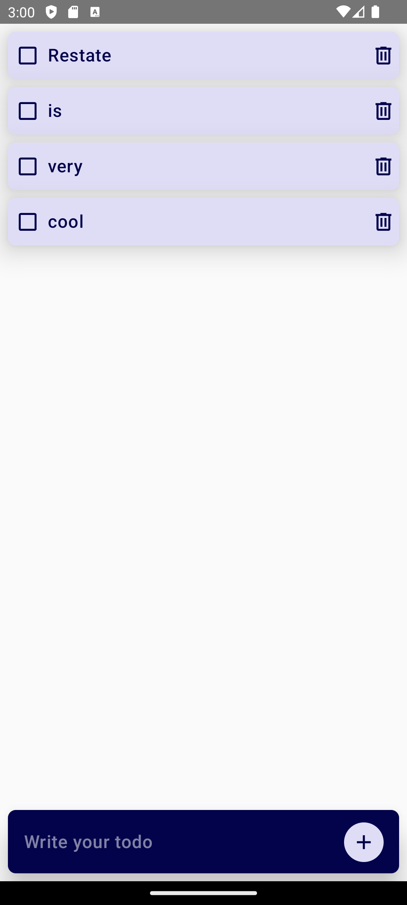

# Kotlin Multiplatform example Android app + Restate backend

Kotlin multiplatform example for a Todo app using Restate as backend:

This project contains:

* The [shared](./shared) code
* The [Todos Virtual Object](./server/src/main/kotlin/dev/restate/examples/noteapp/Application.kt), to store the todos, built using the Kotlin Restate SDK
* The [Android app](./composeApp) 

For more details on how to use it and run the Android app, check: https://www.jetbrains.com/help/kotlin-multiplatform-dev/get-started.html

To run the Restate server, just follow the same instructions as https://docs.restate.dev/get_started/quickstart?sdk=kotlin