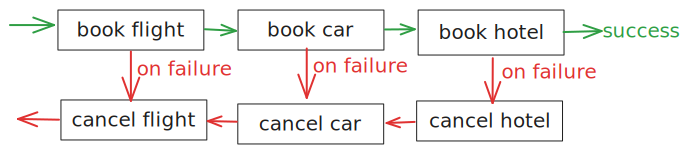

# Kotlin Patterns and Use Cases

### Communication
- **[(Delayed) Message Queue](README.md#delayed-message-queue)**: Use Restate as a queue. Schedule tasks for now or later and ensure the task is only executed once. [](src/main/kotlin/my/example/queue/TaskSubmitter.kt)

#### Orchestration patterns
- **[Sagas](README.md#sagas)**: Preserve consistency by tracking undo actions and running them when code fails halfway through. [](src/main/kotlin/my/example/sagas/BookingWorkflow.kt)

#### Scheduling
- **[Scheduling Tasks](README.md#scheduling-tasks)**: Restate as scheduler: Schedule tasks for later and ensure the task is triggered and executed. [](src/main/kotlin/my/example/schedulingtasks/PaymentTracker.kt)
- **[Parallelizing Work](README.md#parallelizing-work)**: Execute a list of tasks in parallel and then gather their result. [](src/main/kotlin/my/example/parallelizework/FanOutWorker.kt)

#### Event processing
- **[Transactional Event Processing](README.md#transactional-event-processing)**: Processing events (from Kafka) to update various downstream systems in a transactional way. [](src/main/kotlin/my/example/eventtransactions/UserFeed.kt)
- **[Event Enrichment / Joins](README.md#event-enrichment--joins)**: Stateful functions/actors connected to Kafka and callable over RPC. [](src/main/kotlin/my/example/eventenrichment/PackageTracker.kt)

## (Delayed) Message Queue
[](src/main/kotlin/my/example/queue/TaskSubmitter.kt)

Use Restate as a queue. Schedule tasks for now or later and ensure the task is only executed once.

- [Task Submitter](src/main/kotlin/my/example/queue/TaskSubmitter.kt): schedules tasks via send requests with and idempotency key.
   - The **send requests** put the tasks in Restate's queue. The task submitter does not wait for the task response.
   - The **idempotency key** in the header is used by Restate to deduplicate requests.
   - If a delay is set, the task will be executed later and Restate will track the timer durably, like a **delayed task queue**.
- [Async Task Worker](src/main/kotlin/my/example/queue/AsyncTaskService.kt): gets invoked by Restate for each task in the queue.

## Sagas
[](src/main/kotlin/my/example/sagas/BookingWorkflow.kt)
[](https://docs.restate.dev/guides/sagas)

When building distributed systems, it is crucial to ensure that the system remains consistent even in the presence of failures.
One way to achieve this is by using the Saga pattern.

Sagas are a way to manage transactions that span multiple services.
They allow you to run compensations when your code crashes halfway through.
This way, you can ensure that your system remains consistent even in the presence of failures.

Restate guarantees that sagas run to completion. It will handle retries and failures, and ensure that compensations are executed successfully.



Note that the compensating actions need to be idempotent.


<details>
<summary><strong>Running the example</strong></summary>

1. [Start the Restate Server](https://docs.restate.dev/develop/local_dev) in a separate shell:
```
restate-server
```
2. Start the service: 
```
./gradlew -PmainClass=my.example.sagas.BookingWorkflowKt run
```
3. Register the services (with `--force` to override the endpoint during **development**):
```shell
restate -y deployments register --force localhost:9080
```

Have a look at the logs to see how the compensations run in case of a terminal error.

Start the workflow:
```shell
curl localhost:8080/BookingWorkflow/run --json '{
  "customerId": "12345",
  "flights": {
    "flightId": "12345",
    "passengerName": "John Doe"
  },
  "car": {
    "pickupLocation": "Airport",
    "rentalDate": "2024-12-16"
  },
  "hotel": {
    "arrivalDate": "2024-12-16",
    "departureDate": "2024-12-20"
  }
}'
```

Have a look at the logs to see the cancellations of the flight and car booking in case of a terminal error:

<details>
<summary><strong>View logs</strong></summary>

```shell
2025-05-29 16:31:30 INFO  [BookingWorkflow/run] dev.restate.sdk.core.statemachine.State - Start invocation
2025-05-29 16:31:30 INFO  [BookingWorkflow/run][inv_10Z6HnK6B8VO06Wp9GVmnzwnZiFa7P3t9D] Flights - Flight reservation created for customer: 12345
2025-05-29 16:31:30 INFO  [BookingWorkflow/run][inv_10Z6HnK6B8VO06Wp9GVmnzwnZiFa7P3t9D] CarRentals - Car rental reservation created for customer: 12345
2025-05-29 16:31:30 ERROR [BookingWorkflow/run][inv_10Z6HnK6B8VO06Wp9GVmnzwnZiFa7P3t9D] Hotels - [👻 SIMULATED] This hotel is fully booked!
2025-05-29 16:31:30 INFO  [BookingWorkflow/run][inv_10Z6HnK6B8VO06Wp9GVmnzwnZiFa7P3t9D] Hotels - Hotel reservation cancelled for customer: 12345
2025-05-29 16:31:30 INFO  [BookingWorkflow/run][inv_10Z6HnK6B8VO06Wp9GVmnzwnZiFa7P3t9D] CarRentals - Car rental reservation cancelled for customer: 12345
2025-05-29 16:31:30 INFO  [BookingWorkflow/run][inv_10Z6HnK6B8VO06Wp9GVmnzwnZiFa7P3t9D] Flights - Flight reservation cancelled for customer: 12345
2025-05-29 16:31:30 WARN  [BookingWorkflow/run][inv_10Z6HnK6B8VO06Wp9GVmnzwnZiFa7P3t9D] dev.restate.sdk.core.RequestProcessorImpl - Error when processing the invocation
dev.restate.sdk.common.TerminalException: [👻 SIMULATED] This hotel is fully booked!
```

</details>
</details>

## Scheduling Tasks
[](src/main/kotlin/my/example/schedulingtasks/PaymentTracker.kt)

An example of a handler that processes Stripe payment events.
On payment failure, it sends reminder emails to the customer. After a certain number of reminders, it escalates the invoice to the support team.
On payment success, it marks the invoice as paid.

Restate tracks the timer across failures, and triggers execution.

This example shows:
 - **Durable webhook callback event processing**
 - **Scheduling tasks and durable timers**: Sending reminder emails and escalating the invoice to the support team.
 - **Joining and correlating events**: The handler correlates the payment events with the invoice ID.
 - **Stateful service**: The handler keeps track of the number of reminders sent and the invoice status.

<details>
<summary><strong>Running the example</strong></summary>
To run the example, you might want to reduce the time between scheduled calls to see the scheduling in action.

1. [Start the Restate Server](https://docs.restate.dev/develop/local_dev) in a separate shell: `restate-server`
2. Start the service: `./gradlew -PmainClass=my.example.schedulingtasks.PaymentTrackerKt run`
3. Register the services (with `--force` to override the endpoint during **development**): `restate -y deployments register --force localhost:9080`

Send some requests:

- Send a payment failure event to the handler:
  ```shell
  curl -X POST localhost:8080/PaymentTracker/invoice123/onPaymentFailure --json '{
        "type": "customer.subscription_created",
        "created": 1633025000,
        "data": {
        "id": "evt_1JH2Y4F2eZvKYlo2C8b9",
        "customer": "cus_J5K2Y4F2eZvKYlo2"
        }
    }'
  ```

- See how the reminder emails get sent
- Then send a payment success event to the handler:
  ```shell
  curl -X POST localhost:8080/PaymentTracker/invoice123/onPaymentSuccess --json '{
        "type": "customer.subscription_created",
        "created": 1633025000,
        "data": {
        "id": "evt_1JH2Y4F2eZvKYlo2C8b9",
        "customer": "cus_J5K2Y4F2eZvKYlo2"
        }
    }'
  ```

- Have a look at the state to see the invoice got paid:
```shell
restate kv get PaymentTracker invoice123
```

If we lower the time between scheduled calls, we can see the reminder emails being sent out and then the invoice getting escalated to the support team:
<details>
<summary>View logs</summary>

```
2025-03-06 13:53:55 INFO  [PaymentTracker/onPaymentFailure][inv_1hB0HkaqQZyG6Gq5nDhCYU7dO8sFS4f8Dv] dev.restate.sdk.core.InvocationStateMachine - Start invocation
2025-03-06 13:53:55 INFO  [PaymentTracker/onPaymentFailure][inv_1hB0HkaqQZyG6Gq5nDhCYU7dO8sFS4f8Dv] PaymentTracker - Sending reminder email for event: evt_1JH2Y4F2eZvKYlo2C8b9
2025-03-06 13:53:55 INFO  [PaymentTracker/onPaymentFailure][inv_1hB0HkaqQZyG6Gq5nDhCYU7dO8sFS4f8Dv] dev.restate.sdk.core.InvocationStateMachine - End invocation
2025-03-06 13:53:56 INFO  [PaymentTracker/onPaymentFailure][inv_1hB0HkaqQZyG6CC5s8BElVylAkzYnFEYxz] dev.restate.sdk.core.InvocationStateMachine - Start invocation
2025-03-06 13:53:56 INFO  [PaymentTracker/onPaymentFailure][inv_1hB0HkaqQZyG6CC5s8BElVylAkzYnFEYxz] PaymentTracker - Sending reminder email for event: evt_1JH2Y4F2eZvKYlo2C8b9
2025-03-06 13:53:56 INFO  [PaymentTracker/onPaymentFailure][inv_1hB0HkaqQZyG6CC5s8BElVylAkzYnFEYxz] dev.restate.sdk.core.InvocationStateMachine - End invocation
2025-03-06 13:53:57 INFO  [PaymentTracker/onPaymentFailure][inv_1hB0HkaqQZyG60EuuJFPWhMM1HMVvM2VQR] dev.restate.sdk.core.InvocationStateMachine - Start invocation
2025-03-06 13:53:57 INFO  [PaymentTracker/onPaymentFailure][inv_1hB0HkaqQZyG60EuuJFPWhMM1HMVvM2VQR] PaymentTracker - Sending reminder email for event: evt_1JH2Y4F2eZvKYlo2C8b9
2025-03-06 13:53:57 INFO  [PaymentTracker/onPaymentFailure][inv_1hB0HkaqQZyG60EuuJFPWhMM1HMVvM2VQR] dev.restate.sdk.core.InvocationStateMachine - End invocation
2025-03-06 13:53:58 INFO  [PaymentTracker/onPaymentFailure][inv_1hB0HkaqQZyG2yGntTp2f9zJOubDQGEDWV] dev.restate.sdk.core.InvocationStateMachine - Start invocation
2025-03-06 13:53:58 INFO  [PaymentTracker/onPaymentFailure][inv_1hB0HkaqQZyG2yGntTp2f9zJOubDQGEDWV] PaymentTracker - Escalating to evt_1JH2Y4F2eZvKYlo2C8b9 invoice to support team
2025-03-06 13:53:58 INFO  [PaymentTracker/onPaymentFailure][inv_1hB0HkaqQZyG2yGntTp2f9zJOubDQGEDWV] dev.restate.sdk.core.InvocationStateMachine - End invocation
```

</details>
</details>

## Parallelizing work
[](src/main/kotlin/my/example/parallelizework/FanOutWorker.kt)

This example shows how to use the Restate SDK to **execute a list of tasks in parallel and then gather their result**.
Also known as fan-out, fan-in.

The example implements a [worker service](src/main/kotlin/my/example/parallelizework/FanOutWorker.kt), that takes a task as input.
It then splits the task into subtasks, executes them in parallel, and then gathers the results.

Restate guarantees and manages the execution of all the subtasks across failures.
You can run this on FaaS infrastructure, like AWS Lambda, and it will scale automatically.

<details>
<summary><strong>Running the example</strong></summary>

1. [Start the Restate Server](https://docs.restate.dev/develop/local_dev) in a separate shell: `restate-server`
2. Start the service: `./gradlew -PmainClass=my.example.parallelizework.FanOutWorkerKt run`
3. Register the services (with `--force` to override the endpoint during **development**): `restate -y deployments register --force localhost:9080`

Send a request:
```shell
curl -X POST http://localhost:8080/FanOutWorker/run -H "Content-Type: application/json" -d '{"description": "get out of bed,shower,make coffee,have breakfast"}'
```

Check in the logs how all tasks get spawned in parallel.

<details>
<summary>View logs</summary>

```
2025-03-06 12:20:18 INFO  [FanOutWorker/run][inv_1fGEUyfogPKK5cbSCSWzpCkcDpkQIKSzMB] dev.restate.sdk.core.InvocationStateMachine - Start invocation
2025-03-06 12:20:18 INFO  [FanOutWorker/runSubtask][inv_146fBfVLISKb2sCWqesf6uMReXdRKvqmv7] dev.restate.sdk.core.InvocationStateMachine - Start invocation
2025-03-06 12:20:18 INFO  [FanOutWorker/runSubtask][inv_146fBfVLISKb2sCWqesf6uMReXdRKvqmv7] FanOutWorker - Started executing subtask: get out of bed
2025-03-06 12:20:18 INFO  [FanOutWorker/runSubtask][inv_18T9WW6paOhm6eciCeBt5iqHXRY4h2NRvP] dev.restate.sdk.core.InvocationStateMachine - Start invocation
2025-03-06 12:20:18 INFO  [FanOutWorker/runSubtask][inv_18T9WW6paOhm6eciCeBt5iqHXRY4h2NRvP] FanOutWorker - Started executing subtask: shower
2025-03-06 12:20:18 INFO  [FanOutWorker/runSubtask][inv_10kE3b5UcL8L64ghFpHQjeeAEowKNis4dH] dev.restate.sdk.core.InvocationStateMachine - Start invocation
2025-03-06 12:20:18 INFO  [FanOutWorker/runSubtask][inv_10kE3b5UcL8L64ghFpHQjeeAEowKNis4dH] FanOutWorker - Started executing subtask: make coffee
2025-03-06 12:20:18 INFO  [FanOutWorker/runSubtask][inv_1fCFmQ9ulbxL2MBwYCDRgV8Was8PDBedW1] dev.restate.sdk.core.InvocationStateMachine - Start invocation
2025-03-06 12:20:18 INFO  [FanOutWorker/runSubtask][inv_1fCFmQ9ulbxL2MBwYCDRgV8Was8PDBedW1] FanOutWorker - Started executing subtask: have breakfast
2025-03-06 12:20:21 INFO  [FanOutWorker/runSubtask][inv_10kE3b5UcL8L64ghFpHQjeeAEowKNis4dH] FanOutWorker - Execution subtask finished: make coffee
2025-03-06 12:20:21 INFO  [FanOutWorker/runSubtask][inv_10kE3b5UcL8L64ghFpHQjeeAEowKNis4dH] dev.restate.sdk.core.InvocationStateMachine - End invocation
2025-03-06 12:20:24 INFO  [FanOutWorker/runSubtask][inv_146fBfVLISKb2sCWqesf6uMReXdRKvqmv7] FanOutWorker - Execution subtask finished: get out of bed
2025-03-06 12:20:24 INFO  [FanOutWorker/runSubtask][inv_146fBfVLISKb2sCWqesf6uMReXdRKvqmv7] dev.restate.sdk.core.InvocationStateMachine - End invocation
2025-03-06 12:20:25 INFO  [FanOutWorker/runSubtask][inv_1fCFmQ9ulbxL2MBwYCDRgV8Was8PDBedW1] FanOutWorker - Execution subtask finished: have breakfast
2025-03-06 12:20:25 INFO  [FanOutWorker/runSubtask][inv_1fCFmQ9ulbxL2MBwYCDRgV8Was8PDBedW1] dev.restate.sdk.core.InvocationStateMachine - End invocation
2025-03-06 12:20:27 INFO  [FanOutWorker/runSubtask][inv_18T9WW6paOhm6eciCeBt5iqHXRY4h2NRvP] FanOutWorker - Execution subtask finished: shower
2025-03-06 12:20:27 INFO  [FanOutWorker/runSubtask][inv_18T9WW6paOhm6eciCeBt5iqHXRY4h2NRvP] dev.restate.sdk.core.InvocationStateMachine - End invocation
2025-03-06 12:20:27 INFO  [FanOutWorker/run][inv_1fGEUyfogPKK5cbSCSWzpCkcDpkQIKSzMB] FanOutWorker - Aggregated result: get out of bed: DONE, shower: DONE, make coffee: DONE, have breakfast: DONE
2025-03-06 12:20:27 INFO  [FanOutWorker/run][inv_1fGEUyfogPKK5cbSCSWzpCkcDpkQIKSzMB] dev.restate.sdk.core.InvocationStateMachine - End invocation
```

</details>
</details>

## Transactional Event Processing
[](src/main/kotlin/my/example/eventtransactions/UserFeed.kt)

Processing events (from Kafka) to update various downstream systems.
- Durable side effects with retries and recovery of partial progress
- Events get sent to objects based on the Kafka key.
  For each key, Restate ensures that events are processed sequentially and in order.
  Slow events on other keys do not block processing (high fan-out, no head-of-line waiting).
- Ability to delay events when the downstream systems are busy, without blocking
  entire partitions.

<details>
<summary><strong>Running the example</strong></summary>

1. Start the Kafka broker via Docker Compose: `docker compose up -d`.
2. [Start the Restate Server](https://docs.restate.dev/develop/local_dev) with the Kafka broker configuration in a separate shell: `restate-server --config-file restate.toml`
3. Start the service: `./gradlew -PmainClass=my.example.eventtransactions.UserFeedKt run`
4. Register the services (with `--force` to override the endpoint during **development**): `restate -y deployments register --force localhost:9080`
5. Let Restate subscribe to the Kafka topic `social-media-posts` and invoke `UserFeed/processPost` on each message.
    ```shell
    curl localhost:9070/subscriptions -H 'content-type: application/json' \
    -d '{
        "source": "kafka://my-cluster/social-media-posts",
        "sink": "service://UserFeed/processPost",
        "options": {"auto.offset.reset": "earliest"}
    }'
    ```

Start a Kafka producer and send some messages to the `social-media-posts` topic:
```shell
docker exec -it broker kafka-console-producer --bootstrap-server broker:29092 --topic social-media-posts --property parse.key=true --property key.separator=:
```

Let's submit some posts for two different users:
```
userid1:{"content": "Hi! This is my first post!", "metadata": "public"}
userid2:{"content": "Hi! This is my first post!", "metadata": "public"}
userid1:{"content": "Hi! This is my second post!", "metadata": "public"}
```

Our Kafka broker only has a single partition so all these messages end up on the same partition.
You can see in the logs how events for different users are processed in parallel, but events for the same user are processed sequentially.


<details>
<summary><strong>View logs</strong></summary>

```shell
2025-02-27 15:53:37 INFO  [UserFeed/processPost][inv_13puWeoWJykN7MoaUqxxd7a9qfkzzBSkzT] dev.restate.sdk.core.InvocationStateMachine - Start invocation
2025-02-27 15:53:38 INFO  [UserFeed/processPost][inv_1eZjTF0DbaEl6kXNXP0jrPUYtCc9mabKet] dev.restate.sdk.core.InvocationStateMachine - Start invocation
2025-02-27 15:53:38 INFO  [UserFeed/processPost][inv_1eZjTF0DbaEl6kXNXP0jrPUYtCc9mabKet] UserFeed - Creating post ee5b9dde-fc81-4819-a411-916e5c2b0c0d for user userid2
2025-02-27 15:53:38 INFO  [UserFeed/processPost][inv_13puWeoWJykN7MoaUqxxd7a9qfkzzBSkzT] UserFeed - Creating post ea2eb2e4-aeb1-4cee-a903-a6399f0ee6ca for user userid1
2025-02-27 15:53:38 INFO  [UserFeed/processPost][inv_13puWeoWJykN7MoaUqxxd7a9qfkzzBSkzT] UserFeed - Content moderation for post ea2eb2e4-aeb1-4cee-a903-a6399f0ee6ca is still pending... Will check again in 5 seconds
2025-02-27 15:53:38 INFO  [UserFeed/processPost][inv_1eZjTF0DbaEl6kXNXP0jrPUYtCc9mabKet] UserFeed - Content moderation for post ee5b9dde-fc81-4819-a411-916e5c2b0c0d is still pending... Will check again in 5 seconds
2025-02-27 15:53:43 INFO  [UserFeed/processPost][inv_13puWeoWJykN7MoaUqxxd7a9qfkzzBSkzT] UserFeed - Content moderation for post ea2eb2e4-aeb1-4cee-a903-a6399f0ee6ca is done
2025-02-27 15:53:43 INFO  [UserFeed/processPost][inv_1eZjTF0DbaEl6kXNXP0jrPUYtCc9mabKet] UserFeed - Content moderation for post ee5b9dde-fc81-4819-a411-916e5c2b0c0d is still pending... Will check again in 5 seconds
2025-02-27 15:53:43 INFO  [UserFeed/processPost][inv_13puWeoWJykN7MoaUqxxd7a9qfkzzBSkzT] UserFeed - Updating user feed for user userid1 with post ea2eb2e4-aeb1-4cee-a903-a6399f0ee6ca
2025-02-27 15:53:43 INFO  [UserFeed/processPost][inv_13puWeoWJykN7MoaUqxxd7a9qfkzzBSkzT] dev.restate.sdk.core.InvocationStateMachine - End invocation
2025-02-27 15:53:43 INFO  [UserFeed/processPost][inv_13puWeoWJykN6geV0KhVhI46atSq8tEE1j] dev.restate.sdk.core.InvocationStateMachine - Start invocation
2025-02-27 15:53:43 INFO  [UserFeed/processPost][inv_13puWeoWJykN6geV0KhVhI46atSq8tEE1j] UserFeed - Creating post 382f3687-fb11-49fa-912c-18a886dd1ecd for user userid1
2025-02-27 15:53:43 INFO  [UserFeed/processPost][inv_13puWeoWJykN6geV0KhVhI46atSq8tEE1j] UserFeed - Content moderation for post 382f3687-fb11-49fa-912c-18a886dd1ecd is still pending... Will check again in 5 seconds
2025-02-27 15:53:48 INFO  [UserFeed/processPost][inv_1eZjTF0DbaEl6kXNXP0jrPUYtCc9mabKet] UserFeed - Content moderation for post ee5b9dde-fc81-4819-a411-916e5c2b0c0d is still pending... Will check again in 5 seconds
2025-02-27 15:54:23 INFO  [UserFeed/processPost][inv_1eZjTF0DbaEl6kXNXP0jrPUYtCc9mabKet] UserFeed - Content moderation for post ee5b9dde-fc81-4819-a411-916e5c2b0c0d is still pending... Will check again in 5 seconds
2025-02-27 15:54:28 INFO  [UserFeed/processPost][inv_1eZjTF0DbaEl6kXNXP0jrPUYtCc9mabKet] UserFeed - Content moderation for post ee5b9dde-fc81-4819-a411-916e5c2b0c0d is still pending... Will check again in 5 seconds
2025-02-27 15:54:28 INFO  [UserFeed/processPost][inv_13puWeoWJykN6geV0KhVhI46atSq8tEE1j] UserFeed - Content moderation for post 382f3687-fb11-49fa-912c-18a886dd1ecd is done
2025-02-27 15:54:28 INFO  [UserFeed/processPost][inv_13puWeoWJykN6geV0KhVhI46atSq8tEE1j] UserFeed - Updating user feed for user userid1 with post 382f3687-fb11-49fa-912c-18a886dd1ecd
2025-02-27 15:54:28 INFO  [UserFeed/processPost][inv_13puWeoWJykN6geV0KhVhI46atSq8tEE1j] dev.restate.sdk.core.InvocationStateMachine - End invocation
2025-02-27 15:54:33 INFO  [UserFeed/processPost][inv_1eZjTF0DbaEl6kXNXP0jrPUYtCc9mabKet] UserFeed - Content moderation for post ee5b9dde-fc81-4819-a411-916e5c2b0c0d is still pending... Will check again in 5 seconds
2025-02-27 15:54:38 INFO  [UserFeed/processPost][inv_1eZjTF0DbaEl6kXNXP0jrPUYtCc9mabKet] UserFeed - Content moderation for post ee5b9dde-fc81-4819-a411-916e5c2b0c0d is still pending... Will check again in 5 seconds
2025-02-27 15:55:03 INFO  [UserFeed/processPost][inv_1eZjTF0DbaEl6kXNXP0jrPUYtCc9mabKet] UserFeed - Content moderation for post ee5b9dde-fc81-4819-a411-916e5c2b0c0d is done
2025-02-27 15:55:03 INFO  [UserFeed/processPost][inv_1eZjTF0DbaEl6kXNXP0jrPUYtCc9mabKet] UserFeed - Updating user feed for user userid2 with post ee5b9dde-fc81-4819-a411-916e5c2b0c0d
2025-02-27 15:55:03 INFO  [UserFeed/processPost][inv_1eZjTF0DbaEl6kXNXP0jrPUYtCc9mabKet] dev.restate.sdk.core.InvocationStateMachine - End invocation
```

As you see, slow events do not block other slow events.
Restate effectively created a queue per user ID.

The handler creates the social media post and waits for content moderation to finish.
If the moderation takes long, and there is an infrastructure crash, then Restate will trigger a retry.
The handler will fast-forward to where it was, will recover the post ID and will continue waiting for moderation to finish.

You can try it out by killing Restate or the service halfway through processing a post.

</details>
</details>

## Event Enrichment / Joins
[](src/main/kotlin/my/example/eventenrichment/PackageTracker.kt)

This example shows an example of:
- **Event enrichment** over different sources: RPC and Kafka
- **Stateful actors / Digital twins** updated over Kafka
- **Streaming join**
- Populating state from events and making it queryable via RPC handlers.

The example implements a package delivery tracking service.
Packages are registered via an RPC handler, and their location is updated via Kafka events.
The Package Tracker Virtual Object tracks the package details and its location history.

<details>
<summary><strong>Running the example</strong></summary>

1. Start the Kafka broker via Docker Compose: `docker compose up -d`.

2. Start Restate Server with the Kafka broker configuration in a separate shell: `restate-server --config-file restate.toml`

3. Start the service: `./gradlew -PmainClass=my.example.eventenrichment.PackageTrackerKt run`

4. Register the services (with `--force` to override the endpoint during **development**): `restate -y deployments register --force localhost:9080`

5. Let Restate subscribe to the Kafka topic `package-location-updates` and invoke `PackageTracker/updateLocation` on each message.
    ```shell
    curl localhost:9070/subscriptions -H 'content-type: application/json' \
    -d '{
        "source": "kafka://my-cluster/package-location-updates",
        "sink": "service://PackageTracker/updateLocation",
        "options": {"auto.offset.reset": "earliest"}
    }'
    ```

6. Register a new package via the RPC handler:
    ```shell
    curl localhost:8080/PackageTracker/package1/registerPackage \
      -H 'content-type: application/json' -d '{"finalDestination": "Bridge 6, Amsterdam"}'
    ```

7. Start a Kafka producer and publish some messages to update the location of the package on the `package-location-updates` topic:
    ```shell
    docker exec -it broker kafka-console-producer --bootstrap-server broker:29092 --topic package-location-updates --property parse.key=true --property key.separator=:
    ```
   Send messages like
    ```
    package1:{"timestamp": "2024-10-10 13:00", "location": "Pinetree Road 5, Paris"}
    package1:{"timestamp": "2024-10-10 14:00", "location": "Mountain Road 155, Brussels"}
    ```

8. Query the package location via the RPC handler:
    ```shell
    curl localhost:8080/PackageTracker/package1/getPackageInfo
    ```
   or via the CLI: `restate kv get PackageTracker package1`

   You can see how the state was enriched by the initial RPC event and the subsequent Kafka events:

    <details>
    <summary>See Output</summary>

    ```
    🤖 State:
    ―――――――――
                              
     Service  PackageTracker 
     Key      package1        
    
     KEY           VALUE                                            
     package-info  {                                                
                      "finalDestination": "Bridge 6, Amsterdam",  
                      "locations": [                                 
                        {                                            
                          "location": "Pinetree Road 5, Paris",      
                          "timestamp": "2024-10-10 13:00"            
                        },                                            
                        {                                            
                          "location": "Mountain Road 155, Brussels", 
                          "timestamp": "2024-10-10 14:00"            
                        }                                            
                      ]                                              
                    }  
    ```

    </details>

</details>