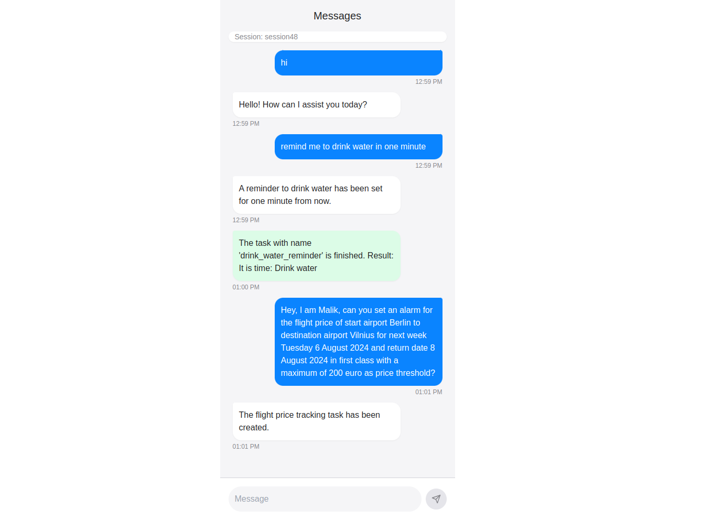

# Restate Chatbot example - Python

This example shows a subset of an AI Agent with Restate.

Restate is a system for easily building resilient applications using **distributed durable building blocks**.

❓ Learn more about Restate from the [Restate documentation](https://docs.restate.dev).

## Running the example

To set up the example, use the following sequence of commands.

Setup the virtual env:

```shell
python3 -m venv .venv
source .venv/bin/activate
```

Install the requirements:

```shell
pip install -r requirements.txt
```

Start the app as follows:

```shell
python3 -m hypercorn --config hypercorn-config.toml chatbot/app:app
```

Start the Restate Server ([other options here](https://docs.restate.dev/develop/local_dev)):

```shell
restate-server
```

Register the service:

```shell
restate dp register http://localhost:8000
```


## Interacting with the chatbot via the UI

```shell
cd simple-chat
npm i 
npm run dev
```

Then open the browser at `http://localhost:3000/` and interact with the chatbot.

For example, you can type:

```
Hey, I am Malik, can you set an alarm in one minute to drink water?
```

Or:

```
Hey, I am Malik, can you set an alarm for the flight price of start airport Berlin to destination airport Vilnius for next week Tuesday 6 August 2024 and return date 8 August 2024 in first class with a maximum of 200 euro as price threshold?
```



## Interacting with the chatbot via HTTP
Then interact with the chatbot via:

```shell
curl localhost:8080/ChatSession/Malik/onMessage  --json '"Hey, I am Malik, can you set an alarm in one minute to drink water?"'
```

Or:

```shell
curl localhost:8080/ChatSession/Malik/onMessage  --json '"Hey, I am Malik, can you set an alarm for the flight price of start airport Berlin to destination airport Vilnius for next week Tuesday 6 August 2024 and return date 8 August 2024 in first class with a maximum of 200 euro as price threshold?"'
```

Or:

```shell
curl localhost:8080/ChatSession/Malik/onMessage  --json '"What is the best offer so far for task id flight_price_berlin_vilnius"'
```

That's it! We managed to run the example, interact with the chatbot, and run tasks!
