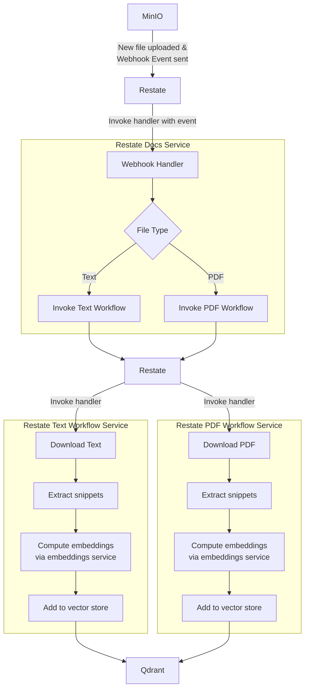

# RAG Ingestion Workflow with Restate's Python SDK 

This repository contains a complete example of how to ingest documents to be used later for RAG.
Upload a file to an S3 bucket (minio in this demo) and see it appear in a vector database.

This demo:
* Shows how to use Restate as a reliable and resilient recipient of webhook events
* How to invoke workflows based on the webhook event
* How to use [LangChain](https://www.langchain.com/) with Restate
* Using Restate's [workflows in Python](https://docs.restate.dev/develop/python/workflows).

Whenever a new file is uploaded to Minio, it triggers a webhook event that is sent to a webhook endpoint. 
The webhook endpoint is here a Restate handler (docs/webhook), that durable persists and processes all incoming events. 
The handler invokes a workflow to downloads the file, extract snippets from it, compute embeddings for all snippets, and add them to a Qdrant vector store.




## Browse the code / Local development

Set up your virtual environment and install the dependencies:

```bash
python -m venv venv
source venv/bin/activate
pip install -r requirements.txt
```

## Running the example

1. Setup ollama locally to download the model
    
    ```
    docker compose pull
    docker compose build
    docker compose up
    ```

2. From a separate terminal, download the embedding model.
We are using `mxbai-embed-large`:

    ```bash
    curl http://localhost:5000/api/pull -d '{ "name": "mxbai-embed-large" }'
    ```

3. All done, now you can go and upload files to this bucket!
   * Minio console [Minio](http://localhost:9001/browser/docs) - user/password: `minioadmin` 
   * Qdrant [Qdrant](http://localhost:6333/dashboard#/collections)

4. Upload any `.txt` / `.pdf` file into the [docs](http://localhost:9001/browser/docs) bucket. For example, upload [`testfile.txt`](testfile.txt).

5. Watch new vectors appear at [docs collection](http://localhost:6333/dashboard#/collections/docs)

Teardown the example via:

```
docker-compose down --remove-orphans
```


