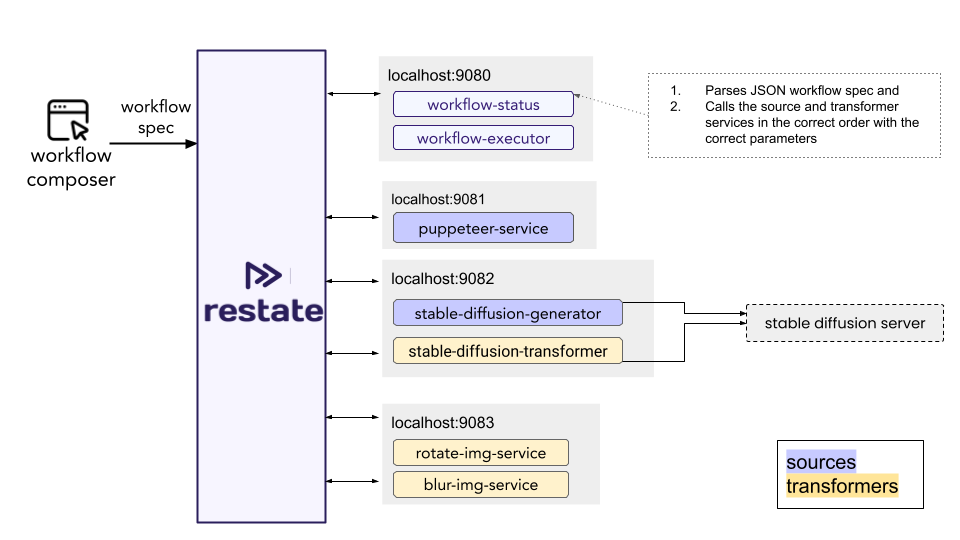

# Dynamic Workflow Executor example

This example shows how to implement a dynamic workflow executor with Restate.

Restate is a system for easily building resilient applications using **distributed durable RPC & async/await**.

❓ Learn more about Restate from the [documentation](https://docs.restate.dev).

The workflow executor is a service that can execute workflows with different steps.
It takes a JSON workflow definition as input and executes the steps in the order in which they are defined and with the specified parameters.

This specific example implements an image processing workflow executor.
The workflow can contain steps that call different image processing services:
- to generate images by taking a screenshot with Puppeteer or by using Stable Diffusion (with prompt specification)
- to transform images based on a prompt with Stable Diffusion
- to rotate images
- to blur images

Here is an overview of the services:




**Note:** This app stores images locally in the `generated-images` folder. These images would of course get lost when the app is restarted. This is just a demo app, so it's not a problem. But in a real app, you would store the images in some persistent storage.

## Running the example

### Deploy Restate Server

Start the restate server via `npx`:
```shell
npx @restatedev/restate-server@latest
```

### Deploy the services 

Install the dependencies
```shell
npm install 
```

Run puppeteer service:
```shell
npm run puppeteer-dev
```

Run transformers service:
```shell
npm run transformers-dev
```

Run stable diffusion service:
```shell
npm run stable-diffusion-dev
```

Run external stable diffusion service:
```shell
npm run external-stable-diffusion-dev
```

Run workflow service:
```shell
npm run workflow-dev
```

Register the services at the Restate Server, using the CLI:

```shell
npx @restatedev/restate dp reg localhost:9080
npx @restatedev/restate dp reg localhost:9081
npx @restatedev/restate dp reg localhost:9082
npx @restatedev/restate dp reg localhost:9083
```

### OPTIONAL: Install and run stable diffusion server

**Note:** You can run this demo without Stable Diffusion. In that case, you cannot use workflow steps that call Stable Diffusion.

Install stable diffusion:

```shell
mkdir stable-diffusion
cd stable-diffusion
```

Follow the steps here:
https://github.com/AUTOMATIC1111/stable-diffusion-webui?tab=readme-ov-file#installation-and-running

It may take some time to install.

Run it with:

```shell
cd stable-diffusion/stable-diffusion-webui
./webui.sh --api
```

For Linux installations, you may have to use the following options, in case you encounter errors:
`export COMMANDLINE_ARGS="--skip-torch-cuda-test --precision full --no-half"`


## Example workflow execution requests

Here is  list of example workflow execution requests that you can send to the workflow executor:

Puppeteer screenshot -> rotate -> blur:

```shell
curl localhost:8080/workflow-executor/execute -H 'idempotency-key: user123-wf1' -H 'content-type: application/json' -d '{"request":"{\"id\":\"user123-wf1\",\"steps\":[{\"service\":\"puppeteer-service\",\"parameters\":{\"url\":\"https://restate.dev\"}},{\"service\":\"rotate-img-service\",\"parameters\":{\"angle\":90}},{\"service\":\"blur-img-service\",\"parameters\":{\"blur\":5}}]}"}'
```

Retrieve the workflow status for id `user123-wf1`:

```shell
curl localhost:8080/workflow-status/get -H 'content-type: application/json' -d '{"key":"user123-wf1"}'
```

Puppeteer screenshot -> stable diffusion -> rotate -> blur:

```shell
curl localhost:8080/workflow-executor/execute -H 'idempotency-key: user123-wf2' -H 'content-type: application/json' -d '{"request":"{\"id\":\"user123-wf2\",\"steps\":[{\"service\":\"puppeteer-service\",\"parameters\":{\"url\":\"https://restate.dev\"}},{\"service\":\"stable-diffusion-transformer\",\"parameters\":{\"prompt\":\"Change the colors to black background and pink font\", \"steps\":25}},{\"service\":\"rotate-img-service\",\"parameters\":{\"angle\":90}},{\"service\":\"blur-img-service\",\"parameters\":{\"blur\":5}}]}"}'
```

Stable diffusion generation (15 steps) -> rotate -> blur:

```shell
curl localhost:8080/workflow-executor/execute -H 'idempotency-key: user123-wf3' -H 'content-type: application/json' -d '{"request":"{\"id\":\"user123-wf3\",\"steps\":[{\"service\":\"stable-diffusion-generator\",\"parameters\":{\"prompt\":\"A sunny beach\", \"steps\":15}},{\"service\":\"rotate-img-service\",\"parameters\":{\"angle\":90}},{\"service\":\"blur-img-service\",\"parameters\":{\"blur\":5}}]}"}'
```

Stable diffusion generation (1 step) -> stable diffusion transformation (1 step) -> rotate -> blur:

```shell
curl localhost:8080/workflow-executor/execute -H 'idempotency-key: user123-wf4' -H 'content-type: application/json' -d '{"request":"{\"id\":\"user123-wf4\",\"steps\":[{\"service\":\"stable-diffusion-generator\",\"parameters\":{\"prompt\":\"A sunny beach\", \"steps\":1}},{\"service\":\"stable-diffusion-transformer\",\"parameters\":{\"prompt\":\"Make it snow on this sunny beach image\", \"steps\":1}},{\"service\":\"rotate-img-service\",\"parameters\":{\"angle\":90}},{\"service\":\"blur-img-service\",\"parameters\":{\"blur\":5}}]}"}'
```

Stable diffusion generation (15 steps) -> stable diffusion transformation (15 steps) -> rotate -> blur:

```shell
curl localhost:8080/workflow-executor/execute -H 'idempotency-key: user123-wf5' -H 'content-type: application/json' -d '{"request":"{\"id\":\"user123-wf5\",\"steps\":[{\"service\":\"stable-diffusion-generator\",\"parameters\":{\"prompt\":\"A sunny beach\", \"steps\":15}},{\"service\":\"stable-diffusion-transformer\",\"parameters\":{\"prompt\":\"Make it snow on this sunny beach image\", \"steps\":15}},{\"service\":\"rotate-img-service\",\"parameters\":{\"angle\":90}},{\"service\":\"blur-img-service\",\"parameters\":{\"blur\":5}}]}"}'
```


Puppeteer screenshot -> blur -> rotate -> rotate -> rotate -> rotate:

```shell
curl localhost:8080/workflow-executor/execute -H 'idempotency-key: user123-wf6' -H 'content-type: application/json' -d '{"request":"{\"id\":\"user123-wf6\",\"steps\":[{\"service\":\"puppeteer-service\",\"parameters\":{\"url\":\"https://restate.dev\"}},{\"service\":\"blur-img-service\",\"parameters\":{\"blur\":5}}, {\"service\":\"rotate-img-service\",\"parameters\":{\"angle\":90}}, {\"service\":\"rotate-img-service\",\"parameters\":{\"angle\":90}}, {\"service\":\"rotate-img-service\",\"parameters\":{\"angle\":90}}, {\"service\":\"rotate-img-service\",\"parameters\":{\"angle\":90}}]}"}' 
```

Invalid workflow definition (no image source is defined):

```shell
curl localhost:8080/workflow-executor/execute -H 'content-type: application/json' -d '{"request":"{\"id\":\"invalid\",\"steps\":[{\"service\":\"rotate-img-service\",\"parameters\":{\"angle\":90}},{\"service\":\"blur-img-service\",\"parameters\":{\"blur\":5}}]}"}'
```


