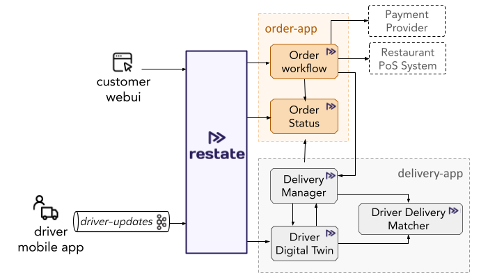

# Food ordering app with Restate

The example application implements an order processing middleware which sits between third-party food ordering providers and restaurants.
Food ordering providers submit orders over HTTP. 
For each event, Restate triggers the `run` handler of the order workflow.
The order service interacts with the restaurants' external point of sale service to request the preparation of the orders.
It also interacts with the delivery services to get the order delivered to the customer once preparation is done.



The app logic (order workflow) discussed in the presentation can be found under: `app/src/order-app/order_workflow/impl.ts`.

## Download the example

- Via the CLI:
   ```shell
   restate example typescript-food-ordering && cd typescript-food-ordering
   ```

- Via git clone:
   ```shell
   git clone git@github.com:restatedev/examples.git
   cd examples/typescript/end-to-end-applications/food-ordering
   ```

- Via `wget`:
   ```shell
   wget https://github.com/restatedev/examples/releases/latest/download/typescript-food-ordering.zip && unzip typescript-food-ordering.zip -d typescript-food-ordering && rm typescript-food-ordering.zip
   ```


## Running locally with Docker compose

Launch the Docker compose setup:
```shell
docker compose build
docker compose up
```

WebUI is running at http://localhost:3000

Jaeger is running at http://localhost:16686

When you are making changes to the code, and you want to trigger a build of the Docker images:

```shell
docker compose build --no-cache
```

Clean up after bringing setup down:
```shell
docker compose rm 
```

### Inspecting state and ongoing invocations
 
If you buy some products via the webUI, you can see how the order workflow is executed by querying the state of the order status service:
```shell
restate kv get order-workflow
```

Or you can check the state of the ongoing invocations via:
```shell
restate invocations list
```

```shell
restate invocations describe <invocation_id>
```

Restate has a psql interface to query the state of the system, via `restate sql <query>`.
Have a look at the introspection documentation to learn more. 

## Exploring the demo

### The order workflow
You can find the implementation of each of the services under `app/src/order-app/`.
The flow of an incoming order is as follows:
1. When the customer places an order via the web UI (localhost:3000), it triggers the `run` handler of the order workflow.
2. The order workflow is implemented in `order_workflow/impl.ts` and consists of the following steps:
    1. The order workflow stores the order status in it's K/V store. First the order status is set to `CREATED`.
    2. The order workflow then triggers the payment by calling a third-party payment provider (implemented as a stub in this example). To do this, the order workflow first generates an idempotency token via a `ctx.run`, and then uses this to call the payment provider. The payment provider can deduplicate retries via the idempotency key.
    3. The workflow then sets the order status to `SCHEDULED` and sets a timer to continue processing after the delivery delay has passed. For example, if a customer ordered food for later in the day, the order will be scheduled for preparation at the requested time. If any failures occur during the sleep, Restate makes sure that the workflow will still wake up on time.
    4. Once the timer fires, the order workflow sends a request to the restaurant point-of-sales system to start the preparation. This is done via an HTTP request from within `ctx.run`. The status of the order is set to `IN_PREPARATION`. The restaurant will use call the `finishedPreparation` handler to signal that the preparation is done. Once this happens, the order workflow will continue and set the order status to `SCHEDULING_DELIVERY`.
    5. Finally, the order workflow calls the delivery manager (`app/src/delivery-app/delivery_manager/impl.ts`) to schedule the delivery of the order (see description below). It then waits on the delivery manager to signal the different phases of delivery it goes through: `WAITING_FOR_DRIVER`, `IN_DELIVERY`, and `DELIVERED`.

### The delivery workflow
To get the order delivered a set of services work together. The delivery manager (`start` method in `delivery_manager/impl.ts`) implements the delivery workflow. It tracks the delivery status, by storing it in Restate's state store, and then requests a driver to do the delivery. To do that, it requests a driver from the driver-delivery matcher. The driver-delivery matcher tracks available drivers and pending deliveries for each region, and matches drivers to deliveries.
Once a driver has been found, the delivery manager assigns the delivery to the driver and sets the order status to `WAITING_FOR_DRIVER`. The delivery has started now. The delivery manager relies for the rest of the delivery updates on the driver digital twin.

The driver's digital twin (`driver_digital_twin/impl.ts`) is the digital representation of a driver in the field. Each driver has a mobile app on his phone (here simulated by `external/driver_mobile_app_sim.ts`) which continuously sends updates to the digital twin of the driver:
1. The driver can notify when they start working: have a look at `driver-mobile-app/startDriver` which calls `driver-digital-twin/setDriverAvailable`.
2. The mobile app also polls the digital twin to check if a new delivery was assigned to the driver. Have a look at `driver-mobile-app/pollForWork` which regularly calls `driver-digital-twin/getAssignedDelivery`.
3. During delivery, the mobile app sends regular location updates over Kafka to the digital twin of the driver. Have a look at the method `driver-digital-twin/handleDriverLocationUpdateEvent`. In the Docker compose file (`docker-compose.yaml`), the `runtimesetup` container executes a curl request to let Restate subscribe to the topic.
4. Once the driver has arrived at the restaurant, the driver's mobile app notifies its digital twin (by calling `driver-digital-twin/notifyDeliveryPickup`). The digital twin then notifies the delivery manager that the driver has picked up the delivery (by calling `delivery-manager/notifyDeliveryPickup`).
5. Finally, the driver arrives at the customer and the driver's mobile app notifies its digital twin (by calling `driver-digital-twin/notifyDeliveryDelivered`). The digital twin then notifies the delivery manager that the driver has picked up the delivery (by calling `delivery-manager/notifyDeliveryDelivered`).
6. The delivery manager then notifies the order workflow that the order got delivered, so that it completes.

## Attribution

The implementation of the web app is based on the MIT Licensed repository here: https://github.com/jeffersonRibeiro/react-shopping-cart.

## Releasing (for Restate developers)

### Upgrading Typescript SDK

Upgrade the `@restatedev/restate-sdk` version as described [here](../../README.md#adding-examples-and-releasing-for-restate-developerscontributors).
Then run the example via Docker compose.