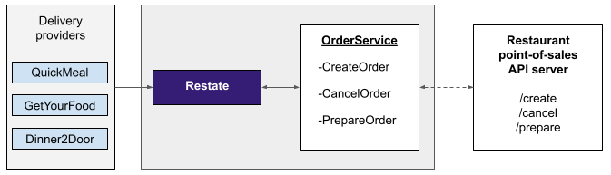
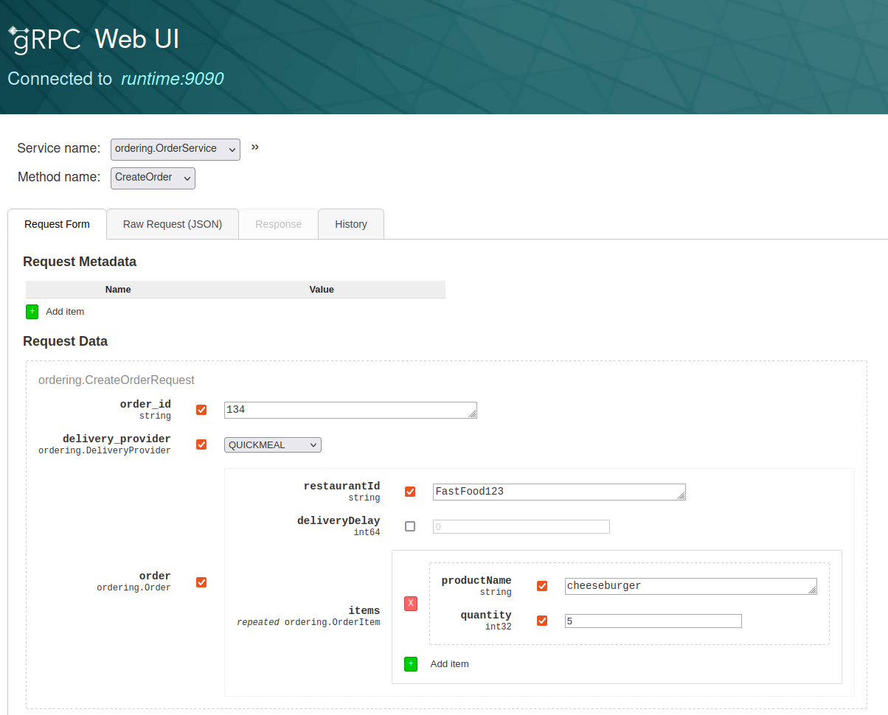
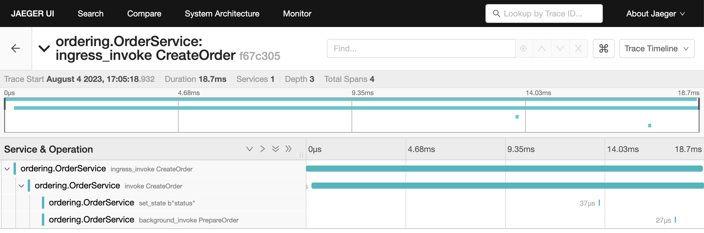

# Restate Example: Food ordering middleware

This repository contains an example of the order processing middleware of a fast food chain implemented with Restate's grpc-based Typescript SDK.

Restate is a system for easily building resilient applications using **distributed durable RPC & async/await**.

❓ Learn more about Restate from the [Restate documentation](https://docs.restate.dev).

This example showcases the awakeables SDK feature of Restate that allows you to pause a handler execution, send a callback token to an external system, and resume the handler execution once the external system has delivered the token back.

It also showcases delayed calls to reliably schedule tasks for later moments in time.

## Description

This application implements the order processing middleware that sits between food delivery providers and restaurants. Customers place orders via third-party apps. These apps forward the orders to the Restate application via API requests (CreateOrder / CancelOrder / PrepareOrder). The Restate services process the order and forward it to the appropriate point-of-sale (restaurant handling the order).

The app is implemented as a single keyed service that is keyed by orderId and maintains the state machine of that order (i.e. the status of the order) as state in Restate. Then you have three different RPC handlers to execute the ordering process.



When an order is created a workflow is executed to check if the restaurant isR open and if all products are in stock. If this is the case then the order is accepted and gets created in the point of sales system of the restaurant. To implement this with Restate, you don't need to set up a database or workflow orchestration engine. The workflow becomes just another gRPC method that can be called and retried. It calls the point of sales software of the restaurants as side effects and saves the state of the workflow in Restate.

### Delayed calls

Customers can schedule an order for later on (deliveryDelay). This is implemented via Restate's delayed calls that schedule the preparation of the order to take place at the desired time. This delayed call is persisted in Restate. Restate ensures that it happens, and takes care of retries to prevent lost orders and unhappy customers.

Have a look at the implementation of the `createOrder` function in the OrderService in `services/src/order_service.ts`.

### Awakeables

When the order needs to be prepared, the OrderService creates an awakeable and sends the awakeable ID (callback token) together with the preparation request to the point of sales API of the restaurant. The workflow is paused during the preparation. Once the restaurant has finished the preparation, it delivers the awakeable ID back to the OrderService. The OrderService then notifies the delivery provider that they should send a driver to the restaurant.

Have a look at the implementation of the `prepareOrder` function in the OrderService in `services/src/order_service.ts`.

## Prerequisites

> **Note**
> Make sure you have [signed up for Restate's private beta](https://forms.gle/G8kDuucqhBoTfMwLA) and set up [access to Restate's packages](https://github.com/restatedev/restate-dist).

- Latest stable version of [NodeJS](https://nodejs.org/en/) >= v18.17.1 and [npm CLI](https://docs.npmjs.com/downloading-and-installing-node-js-and-npm) >= 9.6.7 installed.
- [Docker Engine](https://docs.docker.com/engine/install/) to launch the Restate runtime (not needed for the app implementation itself).
- Optional: Docker Compose

## Deployment with Docker Compose

Build the services:

```shell
docker build ./services/ -t dev.local/food-ordering/services:0.0.1 --secret id=npmrc,src=$HOME/.npmrc
docker build ./pos_server/ -t dev.local/food-ordering/pos_server:0.0.1
```

Launch the Docker compose setup:

```shell
docker compose up
```

Create a new order for five cheeseburgers at `FastFood123` with immediate delivery

You can do this via curl:

```shell
curl -X POST http://localhost:9090/ordering.OrderService/CreateOrder -H 'content-type: application/json' -d '{
  "deliveryProvider": "QUICKMEAL",
  "orderId": "134",
  "order": {"restaurantId": "FastFood123", "deliveryDelay": 0, "items": [{"productName": "cheeseburger", "quantity": 5}]}
}'
```

If you want to have an easy web form to send requests, you can use the gRPC Web UI (at http://localhost:3030).
Fill in the form:



and click `Invoke`.

Create a new order for five cheeseburgers at `FastFood123` with delivery delayed for 10 seconds:

```shell
curl -X POST http://localhost:9090/ordering.OrderService/CreateOrder -H 'content-type: application/json' -d '{
  "deliveryProvider": "QUICKMEAL",
  "orderId": "174",
  "order": {"restaurantId": "FastFood123", "deliveryDelay": 10000, "items": [{"productName": "cheeseburger", "quantity": 5}]}
}'
```

You can also check the status of the delivery via:

```shell
curl -X POST http://localhost:9090/ordering.OrderService/GetOrderStatus -H 'content-type: application/json' -d '{ "orderId": "174" }'
```

To understand the requests that are done, you can have a look at the logs of the runtime, service and PoS server.
For the delayed order request, you will see the late order being scheduled for preparation after 10 seconds.

You can also have a look at the Jaeger UI at http://localhost:16686.


## Running locally

### Run the services

Install the dependencies, generate the Protobuf code and build the application:

```shell
cd services
npm install && npm run proto && npm run build
```

Run the application with:

```shell
npm run app
```

### Run the point of sales server

In another terminal session, run the point of sales server.

Install the dependencies and build the application:

```shell
cd pos_server
npm install && npm run build
```

Run the application with:

```shell
npm run app
```

### Start the Restate runtime

Now [launch the runtime](../../README.md#launching-the-runtime) and [discover the services](../../README.md#connect-runtime-and-services).

### Send requests to the service

Create a new order for five cheeseburgers at `FastFood123` with immediate delivery:

```shell
curl -X POST http://localhost:9090/ordering.OrderService/CreateOrder -H 'content-type: application/json' -d '{
  "deliveryProvider": "QUICKMEAL",
  "orderId": "134",
  "order": {"restaurantId": "FastFood123", "deliveryDelay": 0, "items": [{"productName": "cheeseburger", "quantity": 5}]}
}'
```

Create a new order for five cheeseburgers at `FastFood123` with delivery delayed for 10 seconds:

```shell
curl -X POST http://localhost:9090/ordering.OrderService/CreateOrder -H 'content-type: application/json' -d '{
  "deliveryProvider": "QUICKMEAL",
  "orderId": "174",
  "order": {"restaurantId": "FastFood123", "deliveryDelay": 10000, "items": [{"productName": "cheeseburger", "quantity": 5}]}
}'
```

## Releasing

### Upgrading Typescript SDK

Upgrade the `@restatedev/restate-sdk` version as described [here](../../README.md#upgrading-the-sdk-dependency-for-restate-developers).
