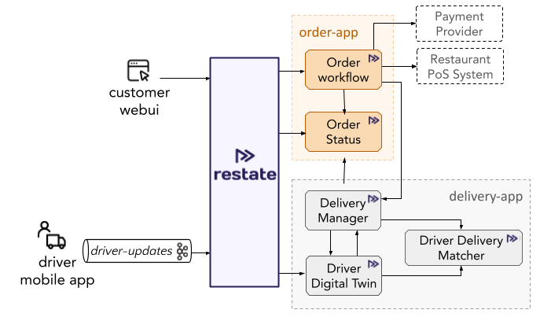

# Food ordering app with Restate

The code in this repo was used for:
- Current 2023 presentation

The example application implements an order processing middleware which sits between third-party food ordering providers and restaurants.
Food ordering providers interact with the application by publishing events to Kafka. 
For each event, Restate triggers the `create` workflow of the order service.
The order service interacts with the restaurants' external point of sale service to request the preparation of the orders.
It also interacts with the delivery services to get the order delivered to the customer once preparation is done.



The app logic (order workflow) discussed in the presentation can be found under: `app/src/restate-app/services/order_workflow.ts`.

## Download the example

- Via the CLI:
   ```shell
   restate example typescript-food-ordering && cd typescript-food-ordering
   ```

- Via git clone:
   ```shell
   git clone git@github.com:restatedev/examples.git
   cd examples/typescript/food-ordering
   ```

- Via `wget`:
   ```shell
   wget https://github.com/restatedev/examples/releases/latest/download/typescript-food-ordering.zip && unzip typescript-food-ordering.zip -d typescript-food-ordering && rm typescript-food-ordering.zip
   ```


## Running locally with Docker compose

Launch the Docker compose setup:
```shell
docker compose up
```

WebUI is running at http://localhost:3000

Jaeger is running at http://localhost:16686

When you are making changes to the code, and you want to trigger a build of the Docker images:

```shell
docker compose build --no-cache
```

Clean up after bringing setup down:
```shell
docker compose rm 
```

### Inspecting state and ongoing invocations

Restate has a psql interface to query the state of the system. 
 
If you buy some products via the webUI, you can see how the order workflow is executed by querying the state of the order status service:
```shell
watch -n 1 'psql -h localhost -p 9071 -c "select service, service_key_utf8, key, value_utf8 from state s where s.service='"'"'orderStatus'"'"';"'
```

Or have a look at the state of all the services, except for the driver simulator:
```shell
watch -n 1 'psql -h localhost -p 9071 -c "select service, service_key_utf8, key, value_utf8 from state s where s.service not in ('"'"'driverSimulator'"'"');"'
```

Or you can check the state of the ongoing invocations via:
```shell
watch -n 1 'psql -h localhost -p 9071 -c "select service, method, service_key_utf8, id, status, invoked_by_service, invoked_by_id from sys_status;"'
```

## Exploring the demo

### The order workflow
You can find the implementation of each of the services under `app/src/order-app/`.
The flow of an incoming order is as follows:
1. When the customer places an order via the web UI (localhost:3000), an order event is published to Kafka.
2. Restate subscribes to the order topic and triggers the order workflow for each incoming event. This subscription is set up by executing two curl commands, as done in the Docker compose file (`docker-compose.yaml`) by the `runtimesetup` container.
3. The order workflow is implemented in `order_workflow.ts` and consists of the following steps:
    1. When the order workflow is triggered, it first parses the raw Kafka event and extracts the order details.
    2. It then calls the order status service (`order_status.ts`) to create a new order in the system. The order status service is a keyed service which tracks the status of each order by storing it in Restate's key-value store.
    3. The order workflow then triggers the payment by calling a third-party payment provider (implemented as a stub in this example). To do this, the order workflow first generates an idempotency token via a side effect, and then uses this to call the payment provider. The payment provider can deduplicate retries via the idempotency key.
    4. The workflow then sets the order status to `SCHEDULED` and sets a timer to continue processing after the delivery delay has passed. For example, if a customer ordered food for later in the day, the order will be scheduled for preparation at the requested time. If any failures occur during the sleep, Restate makes sure that the workflow will still wake up on time.
    5. Once the timer fires, the order workflow creates an awakeable and sends a request to the restaurant point-of-sales system to start the preparation. This is done via an HTTP request from within a side effect. The status of the order is set to `IN_PREPARATION`. The restaurant will use the awakeable callback to signal when the prepration is done. Once this happens, the order workflow will continue and set the order status to `SCHEDULING_DELIVERY`.
    6. Finally, the order workflow calls the delivery manager of the delivery app (`app/src/delivery-app/delivery_manager.ts`) to schedule the delivery of the order (see description below). It does this by using an awakeable, that the delivery manager will use to signal when the delivery is done. Once the delivery is done, the order workflow will set the order status to `DELIVERED`.

### The delivery workflow
To get the order delivered a set of services work together. Have a look at the code of the delivery app under `src/app/delivery-app`. The delivery manager (`start` method in `delivery_manager.ts`) implements the delivery workflow. It tracks the delivery status, by storing it in Restate's state store, and then requests a driver to do the delivery. To do that, it requests a driver from the driver-delivery matcher. The driver-delivery matcher tracks available drivers and pending deliveries for each region, and matches drivers to deliveries.
Once a driver has been found, the delivery manager assigns the delivery to the driver and sets the order status to `WAITING_FOR_DRIVER`. The delivery has started now. The delivery manager relies for the rest of the delivery updates on the driver digital twin.

The driver's digital twin (`driver_digital_twin.ts`) is the digital representation of a driver in the field. Each driver has a mobile app on his phone (here simulated by `external/driver_mobile_app_sim.ts`) which continuously sends updates to the digital twin of the driver:
1. The driver can notify when they start working: have a look at `driver-mobile-app/startDriver` which calls `driver-digital-twin/setDriverAvailable`.
2. The mobile app also polls the digital twin to check if a new delivery was assigned to the driver. Have a look at `driver-mobile-app/pollForWork` which regularly calls `driver-digital-twin/getAssignedDelivery`.
3. During delivery, the mobile app sends regular location updates over Kafka to the digital twin of the driver. Have a look at the method `driver-digital-twin/handleDriverLocationUpdateEvent`.
4. Once the driver has arrived at the restaurant, the driver's mobile app notifies its digital twin (by calling `driver-digital-twin/notifyDeliveryPickup`). The digital twin then notifies the delivery manager that the driver has picked up the delivery (by calling `delivery-manager/notifyDeliveryPickup`).
5. Finally, the driver arrives at the customer and the driver's mobile app notifies its digital twin (by calling `driver-digital-twin/notifyDeliveryDelivered`). The digital twin then notifies the delivery manager that the driver has picked up the delivery (by calling `delivery-manager/notifyDeliveryDelivered`).
6. The delivery manager then sets the order status to `DELIVERED`. And the order workflow gets completed, by resolving the awakeable.

## Presenting the demo at conferences
To present the demo at conferences, you can run the Restate server and restate-app outside of Docker compose. 
This allows you to show the code execution retries via ts-node-dev and the logs of the services in the terminal.

### Run the order app

```shell    
cd app
npm install 
npm run app-dev
```


### Launch Restate and register services

Run with `npx` or have a look at other options to [launch the Restate Server](../../README.md#launching-the-restate-server).
```shell
npx @restatedev/restate-server@latest --config-file restate-local.yaml --wipe all 
```

Assuming you have the CLI installed, register the services:
```shell
restate dp reg order_app:9080
restate dp reg delivery_app:9081
```

Subscribe Restate to the Kafka `driver-updates` topic:

```shell
curl localhost:9070/subscriptions -H 'content-type: application/json' -d '{"source":"kafka://my-cluster/driver-updates", "sink":"service://driver-digital-twin/handleDriverLocationUpdateEvent" }'
```

Start a driver:

```shell
curl localhost:8080/driver-mobile-app/startDriver -H 'content-type: application/json' -d '{"key": "driver-01", "request": {} }' 
```

## Attribution

The implementation of the web app is based on the MIT Licensed repository here: https://github.com/jeffersonRibeiro/react-shopping-cart.

## Releasing (for Restate developers)

### Upgrading Typescript SDK

Upgrade the `@restatedev/restate-sdk` version as described [here](../../README.md#upgrading-the-sdk-dependency-for-restate-developers).
Then run the example via Docker compose.