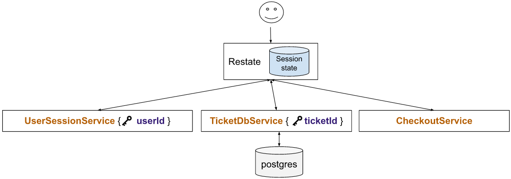

# Restate Example: Ticket reservation system

This example shows a subset of a ticket booking system to illustrate how Restate solves many problems with microservice architectures.

Restate is a system for easily building resilient applications using **distributed durable RPC & async/await**.

❓ Learn more about Restate from the [Restate documentation](https://docs.restate.dev).

## Download the example

Via the CLI:
```shell
restate example typescript-ticket-reservation && cd typescript-ticket-reservation
```

Or clone the entire git repo:

```shell
git clone git@github.com:restatedev/examples.git
cd examples/typescript/ticket-reservation
```

Or download the example with `wget`:
```shell
wget https://github.com/restatedev/examples/releases/latest/download/typescript-ticket-reservation.zip && unzip typescript-ticket-reservation.zip -d typescript-ticket-reservation && rm typescript-ticket-reservation.zip
```


## Quickstart

To set up the example, use this sequence of commands:

```shell
npm install
npm run build
npm run app
```

For more details check out [Running the example](README.md#running-the-example).

## Description

Imagine a ticket booking systems for concerts, sports games or the cinema. The plot goes as follows:

- Users select tickets (for specific seats), and put them in their shopping cart. Each seat can only be reserved and sold once.
- The tickets are reserved for a limited time (15 minutes), after which the reservation expires and the tickets become available to other buyers again.
- When going through checkout, tickets get permanently reserved, payment is processed, tickets are mailed to the user.

An implementation with Restate could look as follows:



There is a `UserSession` which manages the user session data (content of shopping cart, etc.), a `TicketDb` which keeps track of ticket reservations and sales,
and a `CheckoutProcess` which takes care of the checkout workflow.

You can see in the example architecture that we do not need to set up a database (e.g. Redis) to store session state in the `UserSession`, because we can do this directly in Restate. We also don't need message queues (e.g., Kafka, RabbitMQ) for persistent asynchronous communication or a workflow engine to coordinate multistep tasks.

The implementation using Restate requires fewer dependencies (MQs, DBs) and is simultaneously much simpler: The code uses Restate’s high-level constructs for communication, state, timers, and orchestration. Restate’s approach to piggyback RPC, state, messaging, and durable execution onto the service invocations gives the developer the semantics of virtually failure-free service executions, rather than requiring complex logic that needs to handle all possible combinations failures.

On top of that, Restate can also run the same code as a long-running process and on FaaS platforms (like AWS Lambda) with minimal changes, and comes with power built-in observability tools, like creating OpenTelemetry traces.

Here is an incomplete list of simplifications to the application that are possible when using Restate:

- We use Restate’s **built-in key/value storage** for session state (user’s shopping cart), rather than requiring Redis. Aside from convenience, we also gain robustness, because Restate’s state storage commits changes atomically with completing the service invocations, and has a stronger durability and consistency model than Redis.

- Restate’s **keyed-sharding and concurrency** mechanism makes the `UserSession` simpler. By defining the userId as the service key, Restate automatically ensures all requests for the same user are processed sequentially (single-writer).

- The checkout flow can **model the checkout logic as plain code** and rely on Restate’s **durable execution** to recover the service upon failures and suspend it during long pauses. This is significantly easier than manually modeling the logic as an explicit persistent state machine, and obviates the need for a database to store the workflow state.

- The Restate implementation **needs no message queue** to persist the checkout trigger, because Restate supports persistent messaging out of the box. In fact, also RPCs are always persistent in Restate and retried after all types of node failures.

- Restate natively supports **timers in the form of scheduled RPC calls**, fault-tolerant and fully integrated with Restate’s concurrency model and with the durable execution mechanism. No need for a cron service, an additional database for cron job persistence, and manually wiring this up.

- **Exactly-once RPC / messaging** between the `UserSession` and the `TicketDb` makes it simple to keep their states consistent: No need to add a safety net to the `TicketDb` to catch lost tickets upon failed RPCs, and no corner cases or race conditions round expiry and checkout can happen.

- The `TicketDb` defines the `TicketId` as the service key. Because the service key is the same as the primary key of the database, **accesses to the same row are strictly sequential**, making the transactional logic quite simple.

## Running the example

### Prerequisites

- Latest stable version of [NodeJS](https://nodejs.org/en/) >= v18.17.1 and [npm CLI](https://docs.npmjs.com/downloading-and-installing-node-js-and-npm) >= 9.6.7 installed.
- [Docker Engine](https://docs.docker.com/engine/install/) to launch the Restate runtime (not needed for the app implementation itself).

### Setup

Clone this GitHub repository and navigate to the `ticket-reservation` folder:

```shell
git clone git@github.com:restatedev/examples.git
cd ticket-reservation
```

Next, install the dependencies:

```shell
npm install
```

### Run the service

Once you are done with the implementation, build/run the example app with:

```shell
npm run build
npm run app
```

The user session service, ticket service and checkout service are now up and running!

### Launch Restate and discover services

Now [launch the runtime](../../README.md#launching-the-runtime) and [discover the services](../../README.md#connect-runtime-and-services).

### Call the service

We can now invoke the `addTicket` method of the user session service by executing:

```shell
curl -X POST http://localhost:8080/UserSession/addTicket -H 'content-type: application/json' -d '{"key": "user_1", "request": "Rolling-stones-A22"}'
```

The first time, this should give us `true` back. The second time, it returns `false`
because a single seat cannot be reserved twice.

Now let user `user_1` buy the ticket by calling the `checkout` method of the user session service:

```shell
curl -X POST http://localhost:8080/UserSession/checkout -H 'content-type: application/json' -d '{"key": "user_1"}'
```

That's it! We managed to run the example, add a ticket to the user session cart, and buy it!
